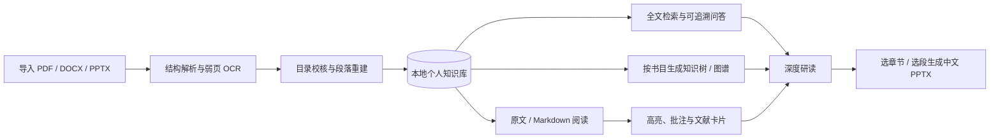
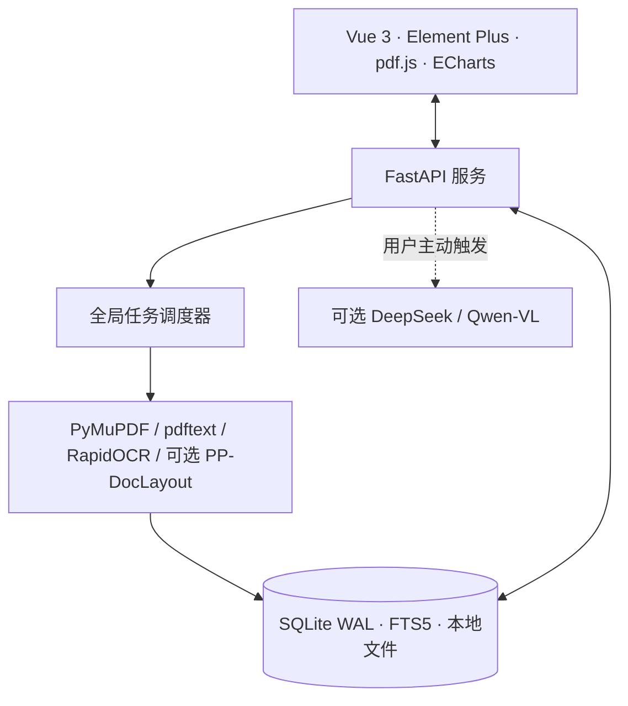

<div align="center">

# Study Assistant · 学习助手

**从原文阅读到知识沉淀与中文汇报，把 PDF、Word、PPT 组织成真正可长期使用的个人文献知识库。**

[](https://www.python.org/)
[](https://vuejs.org/)
[](https://github.com/boway033-cell/Study-assistant/actions)
[](LICENSE)
[](CHANGELOG.md)

本地优先 · 原文证据链 · 结构化阅读 · 知识沉淀 · 写作实验室 · 中文 PPTX

[真实界面](#真实运行界面) · [核心能力](#核心体验) · [快速开始](#快速开始) · [数据边界](#数据边界) · [项目文档](#文档与参与)

</div>


<div align="center"><sub>v1.2.0 本机真实运行页面 · 文献知识库</sub></div>

Study Assistant 面向需要长期阅读教材、论文与讲义的学生、考研学习者和研究者。它不把全部资料塞进一个聊天框，而是围绕**个人知识库**组织一条连续动线：资料归档 → 原文阅读 → 高亮与证据 → 知识树/图谱 → 综合研读 → PPTX 汇报。

与普通“上传 PDF 后聊天”工具不同，它强调三件事：

- **先限定资料范围**：每次研读、建树、图谱和汇报都明确选择单本或多本文献，不把整个资料库无意混合。
- **结论可以回到原文**：目录、页码、文本块、批注、证据卡片和 AI 主张保持来源回链。
- **AI 建议不替代用户判断**：低置信度目录、AI 知识节点和待核验主张进入人工确认流程，不静默写成事实。

> 当前项目优先支持 Windows 本地部署。没有 AI Key 时，资料管理、原文阅读、目录编辑、全文检索、批注和本地知识组织仍可使用。

## 真实运行界面

以下页面均由当前版本在本机真实资料库中直接截取，不是概念图或 AI 生成界面。

<table>
  <tr>
    <td width="50%"><br><b>原文阅读器</b><br><sub>目录导航、连续/单页/双页、缩放、页码定位、高亮与划线。</sub></td>
    <td width="50%"><br><b>文献工作台</b><br><sub>选择证据、设定汇报目标、审阅提纲、渲染与验收。</sub></td>
  </tr>
  <tr>
    <td width="50%"><br><b>笔记与证据</b><br><sub>聚合高亮、划线、批注、知识笔记和证据卡片，同时保持底层实体独立。</sub></td>
    <td width="50%"><br><b>研究报告工作区</b><br><sub>书目/章节范围、AI 自主研读、来源与主张审计、报告流转。</sub></td>
  </tr>
</table>

## 它解决什么问题

| 阅读现场的困难 | Study Assistant 的处理方式 |
|---|---|
| 扫描 PDF 目录断层、序号不连续、正文被误判为标题 | 原生文本与 OCR 按页取证，结合编号连续性、版面和正文语义生成候选目录，并保留人工复核入口 |
| Markdown 被 PDF 换行切碎，段落与句子次序混乱 | 按阅读顺序重建段落，修复跨行断句、页眉页脚和重复文本，再生成结构化 Markdown |
| 问答有结论却找不到依据 | RAG 回答携带书目、章节和页码，可直接回到原文核对 |
| 多本资料一股脑生成图谱，关系失真 | 知识树、图谱和 AI 绘图均先选择单本或多本书目，再独立生成与保存 |
| 分析、OCR 和汇报生成耗时，不知道做到哪一步 | 全局任务中心统一展示导入、OCR、深度分析和 PPTX 进度，重任务串行调度以控制内存 |
| 做完笔记后很难沉淀为汇报 | 可选择章节或选段生成中文、可编辑的 PPTX，并保留来源定位 |
| 文献多后难以按项目、课程同时归档 | 多级虚拟书架支持一书多归属，不移动原文件 |
| 有大量同源文章却难以提炼可复用写法 | 从至少 20 篇完整文章分层蒸馏 Writing DNA，保留版本并支持独立新作与 Word 输出 |
| 文稿有明显模板腔，又不希望普通润色改动事实 | 仅按 11 条白名单执行可审计的最小改写，支持文本和 DOCX |

## 从文献到知识的工作流



## 核心体验

### 1. 先把文献变成可靠的知识底座

- 导入 PDF、DOCX、PPTX，自动归档并建立中文全文索引。
- 资料库提供阅读中、收藏、待处理、未归档与自建书架视图；选中文献后按需查看阅读进度、解析状态、章节和关键词，不必离开当前列表。
- 解析层综合原生文本、OCR、页码、字体和编号序列；低置信度结果进入复核，而不是静默写入错误目录。
- 目录置信度会经过全书编号链校验；可安全自修正错层/错挂和同页错序，也可在阅读器中完整人工校正并回到原页核对。
- 原文、结构化 Markdown、目录、页码和知识片段保持映射，为后续问答与汇报提供证据链。
- OCR 与可选 PP-DocLayout 版面增强按任务唤起，不作为常驻重进程；大型任务串行执行，降低峰值内存。MinerU 目前不进入默认安装与导入链。

### 2. 用适合长文献的阅读器工作

- PDF 支持连续、单页、双页模式，以及目录跳转、缩放、深色阅读和位置记忆；文档导航默认展开并跟随当前章节，无目录时可直接进入结构校正。
- 长题名使用两行自适应文献头，阅读视图、状态与研究动作分级显示；窄窗将研究工具收纳，避免工具栏遮挡正文。
- 原文版、Markdown 精读版与文献卡片可切换；高亮与划线可不写批注直接保存，高亮使用低透明度叠层避免遮字，四色标注和笔记均保存在本地。
- 原生 PDF 使用精确文本命中，跨页划线保存为一个多页锚点；扫描 PDF 仅为当前页按需生成可选择的 OCR 文字层，并在本地缓存坐标。
- 批注同时保存原文、前后文和文档指纹；文件排版变化后可自动校准，无法确定时支持用户重新选择位置。
- 选中文字可解释、翻译、追问或加入研读范围；视觉模型可按需解读图表、公式与扫描页。

### 3. 明确范围，再让 AI 组织知识

- 侧栏使用单一“知识沉淀”入口，进入后再切换笔记、知识树、知识图谱和综合研读；四种模式共享一个书目范围，页面切换时不必重复选书。
- “笔记与证据”聚合展示高亮、划线、批注、知识笔记和证据卡片，但底层保持独立；每条记录携带来源回链，并支持按书目、章节、标签、颜色和时间筛选。
- 高亮需用户确认后才提升为笔记，笔记需用户确认后才加入知识树；多条证据可组合为待核验主张，AI 内容与用户内容使用不同标识。
- 知识树负责层级组织，拖拽变更会先显示影响范围，AI 扩展只生成待确认建议；图谱负责发现概念关系与出处，研究报告工作区负责回答具体的跨文献问题。
- 问答从所选知识库检索证据，答案可定位到文件、章节和页码。
- 研究报告工作区默认采用“AI 自主研读”：DeepSeek 先判断材料类型、拆分子问题并选择分析维度，再在用户限定的书目/章节/笔记内检索与综合；Nature 类能力只承担写作与来源约束，不决定报告结构。
- 可切换观点比较、证据与方法审查、研究缺口探索，并选择快速或深度推演。报告逐条标注主张类型、置信度、反例/限制与精确来源锚点；结果可保存为笔记、证据卡片或发送至 PPTX。

### 4. 从原文章节生成中文文献汇报

- 选择整篇、章节或任意选段作为 PPTX 的内容边界。
- 工作台按“选择证据—设定汇报目标—审阅提纲—渲染验收”推进；长文献按章节分层取样并报告覆盖率。
- AI 依据论文类型重建论证主线，不机械复刻原文目录；一页一个主要主张，统一术语，并显式呈现证据意义、局限和外推边界。
- 提纲可逐页人工编辑，来源侧栏会标出数字、定位或主张一致性问题；PPTX 演讲者备注保留主张、章节/页码和证据摘录。
- SI/图表的许可证和权利状态进入输出门禁；本机 PowerPoint 可实际渲染逐页预览并做视觉回归。
- 支持开放获取、arXiv、Unpaywall 与图书馆/Chrome 登录态交接等合法全文入口；页面会明确展示开放路径、登录接续和校验导入，不会绕过付费墙或访问控制。

### 5. 从个人语料沉淀写作方法

- 在文献工作台进入“写作实验室”，选择至少 20 篇完整文章，分别分析语言、结构、选题与素材策略、认知框架和视觉风格；补充语料或反馈会生成可追溯的新版本。
- 仿写只借鉴抽象写作规律，使用 5 篇主题相近原文校准语感，不复制原文事实和独特表达，也不冒充原作者；新作可导出 Word。
- 文本与 DOCX 可执行白名单式“去 AI 味”。系统只修改明确命中的 11 类问题，并展示接受、拒绝和规则审计；数字、引语、链接、限定词及 Word 原有结构受到保护。
- 写作实验室调用当前配置的 DeepSeek 接口；全文统计在本机逐篇完成，仅有限代表片段或待处理文本会在用户发起任务时发送给模型。

## 快速开始

### Windows 源码运行

前置环境：Python 3.12+、Node.js 22+。

```powershell
git clone https://github.com/boway033-cell/Study-assistant.git
cd Study-assistant

python -m venv .venv
.\.venv\Scripts\python.exe -m pip install -r requirements.txt

# 安装并构建前端：
cd frontend
npm ci
npm run build
cd ..

# 启动并自动打开浏览器
.\start.bat
```

启动器会在服务健康后打开实际页面（默认 `http://127.0.0.1:8000`，冲突时自动选择 8001–8010），使用 `stop.bat` 停止。固定的 `127.0.0.1` 地址只能访问已经运行的服务，不能自行唤醒已停止的本地程序。若只运行后端，也可以执行：

```powershell
.\.venv\Scripts\python.exe -m uvicorn backend.app.main:app --host 127.0.0.1 --port 8000
```

### 注册稳定网页唤醒入口（推荐）

```powershell
powershell -NoProfile -ExecutionPolicy Bypass -File .\scripts\protocol\install.ps1
```

注册后，安装脚本会在桌面创建“打开学习助手”网页快捷方式；也可由网页或 Windows 运行框打开 `study-assistant://open`。协议处理器会按需启动本地服务、等待健康检查并打开实际端口，避免把“拒绝连接”页面交给用户。应用不设开机常驻，关闭服务后不占用运行内存。

启动页、阅读器和资料库资源均随前端构建保存在本机，不依赖 Google Fonts、jsDelivr、unpkg 等境外 CDN；本地资料管理、解析与阅读无需 VPN。DeepSeek 与默认视觉接口使用中国大陆可访问的官方端点，开放获取或馆藏页面是否可达则取决于对应文献站点自身。

### 启用 AI（可选）

在应用设置页填写 DeepSeek API Key，即可使用问答、深度研读、出题与 PPTX 生成；视觉分析另需配置 Qwen-VL。也可在根目录 `.env` 中设置 `DEEPSEEK_API_KEY`。Key 只在本机保存并以脱敏形式显示。

## 数据边界

| 数据或操作 | 默认位置 / 去向 |
|---|---|
| 原始文献、SQLite、全文索引、批注 | 本机 `backend/data/` |
| 解析、切块、目录编辑、FTS5 检索 | 本机完成 |
| AI 问答 | 提问与检索到的相关片段发送至已配置的 DeepSeek |
| 深度分析、出题、研读、PPTX | 用户触发后，将所选范围的必要内容发送至 DeepSeek |
| 页面视觉分析 | 用户触发后，将当前页面图像发送至 Qwen-VL |

未配置对应 Key 时不会触发云端能力。完整说明见 [PRIVACY.md](PRIVACY.md)。备份可直接复制 `backend/data/`，或运行 `scripts\maintenance\backup.bat`。

## 技术架构



## 项目状态

- 后端测试：105 项，覆盖解析、目录、文献工作台、知识沉淀、批注、研究报告和数据可靠性。
- 前端单元测试：9 项；另有真实 PDF 的 Playwright 浏览器回归。
- 当前版本：v1.2.0。项目处于持续迭代期，解析质量仍以“证据 + 置信度 + 人工复核”作为安全边界。

```powershell
.\.venv\Scripts\python.exe -m pytest -q
cd frontend
npm run test:unit
npm run build
```

## 文档与参与

- [产品文档](docs/产品文档.md)：定位、功能范围与视觉交互规范
- [项目交接](docs/PROJECT_HANDOVER.md)：开发状态、运行方式与已知边界
- [轻量文档管线](docs/LIGHTWEIGHT_DOCUMENT_PIPELINE.md)：解析、OCR、目录证据与内存约束
- [文献研究工作流](docs/nature-literature-workflow.md)：归档、文献卡片、PPTX 与合法全文路径
- [研究报告方法](docs/RESEARCH_REPORT_METHOD.md)：AI 自主研读、证据审计、外部方法借鉴与资源边界
- [脚本目录](scripts/README.md)：启动、协议、维护、兼容入口与内部工具说明
- [贡献指南](CONTRIBUTING.md) · [安全策略](SECURITY.md) · [变更记录](CHANGELOG.md)

如果这个项目也解决了你的文献阅读问题，欢迎提交 Issue、改进解析样本或贡献代码。

---

<div align="center">以原文为根，以知识为枝。</div>
