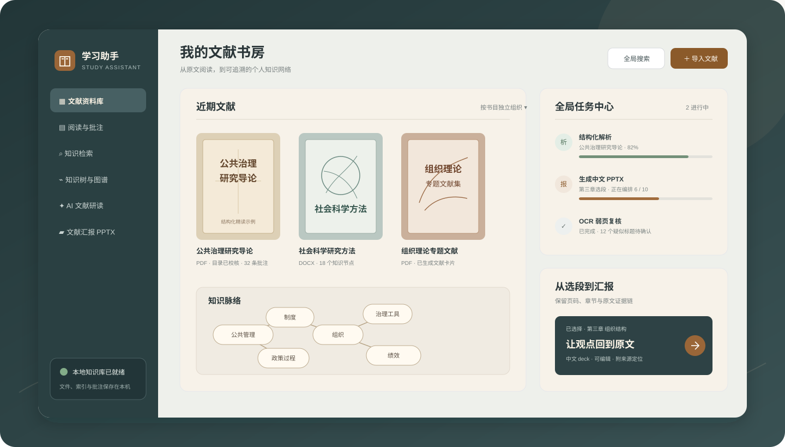
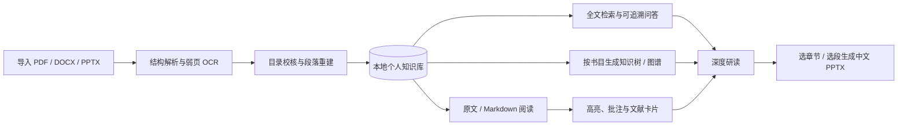
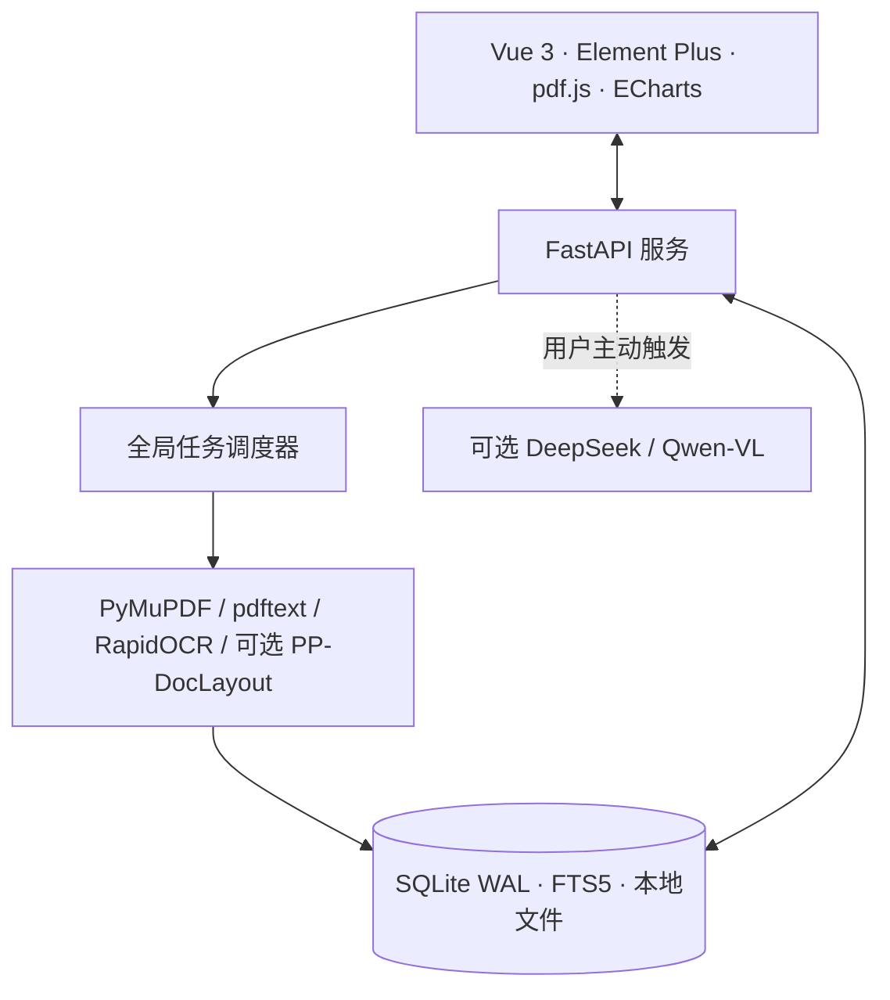

<div align="center">

# Study Assistant · 学习助手

**把散落的 PDF、Word 与 PPT 变成可检索、可追溯、可汇报的个人文献知识库。**

[](https://www.python.org/)
[](https://vuejs.org/)
[](https://github.com/boway033-cell/Study-assistant/actions)
[](LICENSE)

本地优先 · 原文证据链 · 结构化阅读 · 知识树/图谱 · 中文 PPTX

</div>



Study Assistant 面向需要长期阅读教材、论文与讲义的学生和研究者。它不把资料堆成一个聊天框，而是围绕**个人知识库**组织导入、解析、阅读、检索、批注、研读与输出；每本或多本书的知识树、知识图谱和画图任务都由你明确选择范围，避免不同书目被无意混合。

> 当前项目优先支持 Windows 本地部署。没有 AI Key 时，资料管理、原文阅读、目录编辑、全文检索、批注和本地知识组织仍可使用。

## 它解决什么问题

| 阅读现场的困难 | Study Assistant 的处理方式 |
|---|---|
| 扫描 PDF 目录断层、序号不连续、正文被误判为标题 | 原生文本与 OCR 按页取证，结合编号连续性、版面和正文语义生成候选目录，并保留人工复核入口 |
| Markdown 被 PDF 换行切碎，段落与句子次序混乱 | 按阅读顺序重建段落，修复跨行断句、页眉页脚和重复文本，再生成结构化 Markdown |
| 问答有结论却找不到依据 | RAG 回答携带书目、章节和页码，可直接回到原文核对 |
| 多本资料一股脑生成图谱，关系失真 | 知识树、图谱和 AI 绘图均先选择单本或多本书目，再独立生成与保存 |
| 分析、OCR 和汇报生成耗时，不知道做到哪一步 | 全局任务中心统一展示导入、OCR、深度分析和 PPTX 进度，重任务串行调度以控制内存 |
| 做完笔记后很难沉淀为汇报 | 可选择章节或选段生成中文、可编辑的 PPTX，并保留来源定位 |

## 从文献到知识的工作流



## 核心体验

### 1. 先把文献变成可靠的知识底座

- 导入 PDF、DOCX、PPTX，自动归档并建立中文全文索引。
- 解析层综合原生文本、OCR、页码、字体和编号序列；低置信度结果进入复核，而不是静默写入错误目录。
- 原文、结构化 Markdown、目录、页码和知识片段保持映射，为后续问答与汇报提供证据链。
- OCR 与可选 PP-DocLayout 版面增强按任务唤起，不作为常驻重进程；大型任务串行执行，降低峰值内存。MinerU 目前不进入默认安装与导入链。

### 2. 用适合长文献的阅读器工作

- PDF 支持连续、单页、双页模式，以及目录跳转、缩放、深色阅读和位置记忆。
- 原文版、Markdown 精读版与文献卡片可切换；四色高亮、批注和笔记均保存在本地。
- 选中文字可解释、翻译、追问或加入研读范围；视觉模型可按需解读图表、公式与扫描页。

### 3. 明确范围，再让 AI 组织知识

- 知识树、知识图谱和 AI 绘图在生成前选择书目范围：单本研究保持边界，多本文献用于有意识的比较。
- 问答从所选知识库检索证据，答案可定位到文件、章节和页码。
- 综合研读、苏格拉底式训练、自动出题、错题与学习计划共同形成“阅读—理解—复习”闭环。

### 4. 从原文章节生成中文文献汇报

- 选择整篇、章节或任意选段作为 PPTX 的内容边界。
- AI 提炼研究问题、论证脉络、关键证据与结论，输出可继续编辑的中文 deck。
- 支持开放获取、arXiv、Unpaywall 与图书馆/Chrome 登录态交接等合法全文入口；不会绕过付费墙或访问控制。

## 快速开始

### Windows 源码运行

前置环境：Python 3.12+；仅在需要重新构建前端时安装 Node.js 22+。

```powershell
git clone https://github.com/boway033-cell/Study-assistant.git
cd Study-assistant

python -m venv .venv
.\.venv\Scripts\python.exe -m pip install -r requirements.txt

# 仓库已包含前端构建产物；修改前端后再执行：
cd frontend
npm install
npm run build
cd ..

# 启动并自动打开浏览器
.\start.bat
```

应用默认位于 `http://127.0.0.1:8000`，使用 `stop.bat` 停止。若只运行后端，也可以执行：

```powershell
.\.venv\Scripts\python.exe -m uvicorn backend.app.main:app --host 127.0.0.1 --port 8000
```

### 注册网页唤醒入口（可选）

```powershell
powershell -NoProfile -ExecutionPolicy Bypass -File .\install_protocol.ps1
```

注册后可由网页或 Windows 运行框打开 `study-assistant://open`。协议处理器会先启动并完成健康检查，再打开浏览器，避免出现“拒绝连接”页面。

### 启用 AI（可选）

在应用设置页填写 DeepSeek API Key，即可使用问答、深度研读、出题与 PPTX 生成；视觉分析另需配置 Qwen-VL。也可在根目录 `.env` 中设置 `DEEPSEEK_API_KEY`。Key 只在本机保存并以脱敏形式显示。

## 数据边界

| 数据或操作 | 默认位置 / 去向 |
|---|---|
| 原始文献、SQLite、全文索引、批注 | 本机 `backend/data/` |
| 解析、切块、目录编辑、FTS5 检索 | 本机完成 |
| AI 问答 | 提问与检索到的相关片段发送至已配置的 DeepSeek |
| 深度分析、出题、研读、PPTX | 用户触发后，将所选范围的必要内容发送至 DeepSeek |
| 页面视觉分析 | 用户触发后，将当前页面图像发送至 Qwen-VL |

未配置对应 Key 时不会触发云端能力。完整说明见 [PRIVACY.md](PRIVACY.md)。备份可直接复制 `backend/data/`，或运行 `backup.bat`。

## 技术架构



## 项目状态

- 后端单元与架构测试：78 项。
- 前端单元测试：5 项；另有按需运行的 Playwright 浏览器测试。
- 当前版本：v1.0.0。项目处于持续迭代期，解析质量仍以“证据 + 置信度 + 人工复核”作为安全边界。

```powershell
.\.venv\Scripts\python.exe -m pytest -q
cd frontend
npm run test:unit
npm run build
```

## 文档与参与

- [产品文档](docs/产品文档.md)：定位、功能范围与视觉交互规范
- [项目交接](docs/PROJECT_HANDOVER.md)：开发状态、运行方式与已知边界
- [轻量文档管线](docs/LIGHTWEIGHT_DOCUMENT_PIPELINE.md)：解析、OCR、目录证据与内存约束
- [文献研究工作流](docs/nature-literature-workflow.md)：归档、文献卡片、PPTX 与合法全文路径
- [贡献指南](CONTRIBUTING.md) · [安全策略](SECURITY.md) · [变更记录](CHANGELOG.md)

如果这个项目也解决了你的文献阅读问题，欢迎提交 Issue、改进解析样本或贡献代码。

---

<div align="center">以原文为根，以知识为枝。</div>
