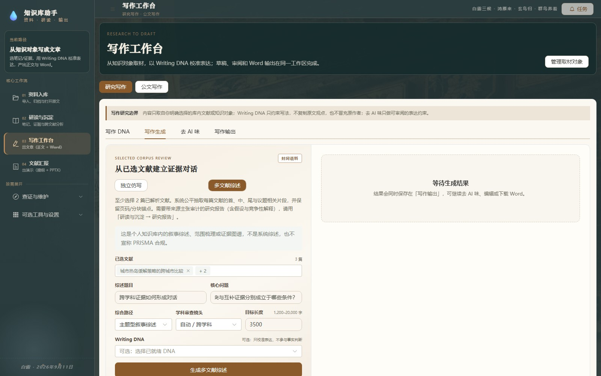
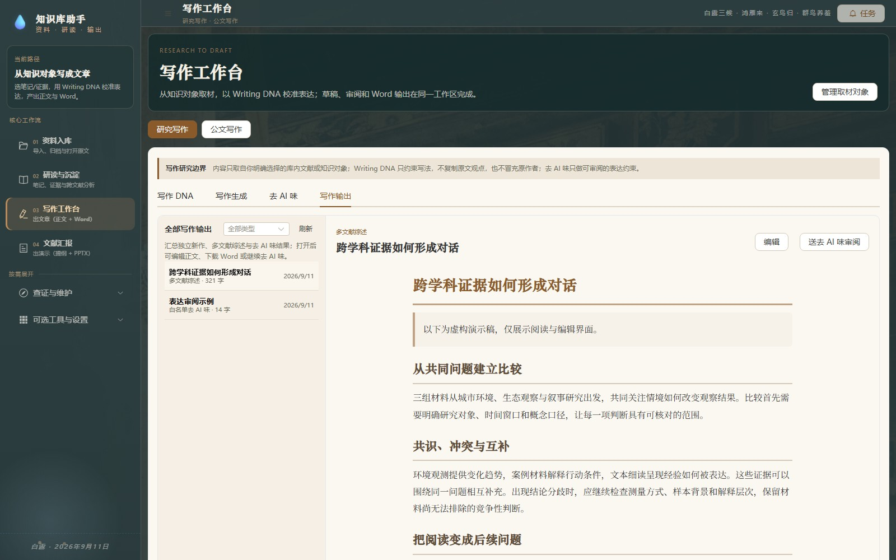

<div align="center">

# Study Assistant
### 让读过的文献，成为下一次思考的起点。

个人文献知识库 · 跨文献研读 · Writing DNA · 写作与汇报

[](CHANGELOG.md)
[](PRIVACY.md)
[](https://github.com/boway033-cell/Study-assistant/actions)

[开始使用](#开始使用) · [写作工作台](#写作工作台) · [版本变化](#232-这次更新了什么) · [产品边界](#适用范围与当前边界)

</div>

Study Assistant 帮你整理自己上传的论文、专著、教材和研究资料。把 PDF、Word、PPT 导入本地知识库后，可以阅读原文、标注证据、比较多篇文献，再把积累的笔记与研究结果用于写作和 PPTX 汇报。

**资料入库 → 阅读与标注 → 知识沉淀 → 跨文献研究 → 写作 / 汇报**


<p align="center"><sub>本页截图来自 2.3.0 实际运行界面，书目、作者、正文和研究结果均为隔离演示库中的虚构样例。</sub></p>

## 从自己的资料开始

如果你长期积累文献，需要找回读过的段落、比较研究结论，并把阅读成果组织成文章，这就是它的主要使用场景。

| 你正在做的事 | 对应工作区 | 留下的成果 |
|---|---|---|
| 整理论文、专著和研究资料 | 资料库 | 书架、书目档案、目录、可检索原文 |
| 阅读、摘录、梳理问题 | 研读与沉淀 | 高亮、批注、知识笔记、证据卡 |
| 比较多篇文献的解释 | 研究报告 | 连贯分析文章、共识与冲突、主张来源 |
| 用已有积累写新文章 | 写作工作台 | Writing DNA、综述、新稿、Word |
| 把研究成果讲给别人 | PPTX 汇报 | 可编辑提纲、演示文件、来源审计 |

导入、阅读、目录修订、全文搜索和本地知识组织可在没有模型 API Key 时使用。需要 AI 时，再配置自己的模型连接。

## 阅读与知识沉淀

### 文献有结构，阅读有落点

PDF、DOCX、PPTX 统一入库。用多级虚拟书架、收藏、阅读状态和排序管理资料；自定义顺序支持拖拽，全库与各书架分别保存。

原文阅读支持连续、单页、双页、目录跳转和位置记忆。长 PDF 按可见范围保留页面节点与画布；双页内容超过屏幕时，先上下滚动，到达边界后再翻页。


扫描件按需 OCR，并显示页级进度。自动目录综合书签、正文、编号与版面信息；需要调整时，可以拖动条目、修改层级和页码、对照原页，保存后继续留在当前工作区。目录修订保留恢复记录。

### 让摘录进入下一次研究

高亮、批注、知识笔记与证据卡分别保存。把摘录提升为笔记，把笔记组织进知识树，并沿来源回到文献与原页。


知识库问答结合全文检索与可选向量召回查找依据。健康检查帮助发现未解析资料、低质量 OCR、缺失目录或元数据、重复资料和失效锚点；知识库洞察关注结构覆盖、来源链与研究成果。

## 跨文献研究：把证据组织成解释

先选文献、章节或笔记，再提出具体问题，例如：“这些研究在哪些条件下形成共识，分歧又来自哪里？”

研究报告支持自主规划分析维度，比较**共识、冲突、互补证据、反例和竞争解释**，形成连贯文章。社会科学、人文与文学、自然科学与生物医学可以采用不同的分析角度。


深度模式对所选长文本分批阅读、综合证据，再分段成文。任务显示阶段进度，已完成的章节或草稿逐步保存。正文把内部定位符转换成紧凑来源标记；主张与完整来源保留在审计区，供核对、修订并回存为知识笔记和证据卡。

研究报告可选用 Writing DNA 校准表达和论证结构。原文观点、综合解释与待验证推断仍需分别辨认。

## 写作工作台

2.3.0 将写作整理为四个入口：**写作 DNA、写作生成、去 AI 味、写作输出**。语料与风格档案在 DNA 中管理，生成与修订的稿件统一进入写作输出。

### 01 · Writing DNA：积累自己的表达习惯

从至少 20 篇有权处理的完整语料中提炼语言、文章结构、论证逻辑和认知习惯。可查看历史版本、补充语料、反馈问题并生成下一版本。


逻辑结构层关注“主张—证据—推理”如何连接，以及段落递进、反驳、让步和收束方式。DNA 用于校准写法；新稿事实取自本次选择的知识对象或文献。

### 02 · 写作生成：新作与多文献综述

**独立新作**从已选知识笔记、证据卡或批判性审查报告取材，结合 DNA、题目、体裁与目标字数成文。

**多文献综述**选择 2–50 篇已解析文献，设定核心问题、综合路径、学科角度与目标长度，比较证据关系。可以选择主题型叙事综述、范围梳理或证据图谱。



综述当前从每篇文献的首、中、尾和议题相关片段构建材料包，并报告引用覆盖。需要对所选全文做分批研读时，使用“研读与沉淀 → 研究报告”的深度模式。

### 03 · 去 AI 味与输出：逐条审阅，继续编辑

对已有文本或 Word 提出最小改写建议，减少机械铺垫、重复例证和冗余表达。可指定 DNA 作为目标语体，逐条接受或撤销修改，并继续编辑、导出 Word。

<table>
<tr>
<td width="50%"><br><b>表达审阅</b><br>保留事实信息，选择需要采用的修改。</td>
<td width="50%"><br><b>统一稿件归档</b><br>按类型找回新作、综述与清洗结果。</td>
</tr>
</table>

公文写作提供材料、提纲、起草、审稿和 Word 排版流程。相关第三方材料含非商业许可，使用前请查看[第三方许可说明](THIRD_PARTY_NOTICES.md)。

## 从知识对象生成 PPTX

选取笔记、证据卡或研究报告，设置受众、用途与时长，先审阅逐页提纲，再生成可编辑 PPTX。每页主张可以核查对应来源，输出同时保留来源、数字与图像权利检查结果。


本机 PowerPoint 可自动化时，可执行逐页渲染；不可用时保留 PPTX 和结构审计结果，并标明尚未完成真实视觉验收。

## 2.3.2 这次更新了什么

- **大文档 OCR 稳定性**：页级任务调度补齐超时、取消与失败隔离；超时 worker 真正退役，迟到结果不写文本、版面或页文本缓存；结算与退役合并到同一临界区，消除「页已结算但退役未登记」的并发竞态。
- **OCR 性能（第一、二阶段）**：任务级共享单 worker 执行器、引擎空闲延迟释放、空白页跳过并写空缓存、分阶段性能指标；有限并发流水线（单生产者 + 多 worker + 协调器看门狗）作为实验能力保留。
- **默认仍是单 worker**：216 页真实扫描件基准显示，当前 RapidOCR / ONNX Runtime 环境下 `OCR_WORKERS=2`、`=3` 均为负加速（0.83× / 0.46×），默认值保持 `OCR_WORKERS=1`；2~4 属实验性配置，需自行基准确认后再启用。
- **测试**：新增超时退役、迟到结果丢弃、STUCK 精确语义、引擎生命周期与 OCR 进度单调的确定性用例。

基准方法、三轮对比与已知限制见[OCR 性能优化方案](docs/OCR_PERFORMANCE_OPTIMIZATION_PLAN.md)。

## 2.3.0 更新回顾

- **长文阅读**：连续模式窗口化渲染、页面资源释放、引用切换时正确换源；目录校正和按页文本复用缓存。
- **写作流程**：四个入口、统一输出归档；Writing DNA 增加逻辑结构层，并用于研究报告和表达审阅。
- **后台任务**：新作与文本 / Word 去 AI 味进入任务中心；问答可停止输出，失败任务提供重试或返回工作区的入口。
- **检索与列表**：筛选分页交给数据库，章节上下文批量获取，JSON 响应压缩，幂等读取失败时重试一次。
- **持续使用**：研究训练和绘图会话持久化，长文阅读行宽、部分键盘操作和触控目标得到调整。

开发扫描与剩余项见[项目交接](docs/PROJECT_HANDOVER.md)，逐项变化见[变更日志](CHANGELOG.md)。

## 模型与数据

可配置 DeepSeek、Kimi、智谱 GLM、通义、OpenAI、Anthropic、Gemini 或自定义连接。按任务选择模型和回退顺序；内置适配支持 OpenAI Chat、Anthropic Messages 和 Gemini 协议。

| 操作 | 数据去向 |
|---|---|
| 文献、数据库、批注、笔记和输出 | 默认保存于本机 `backend/data/` |
| 本地解析、OCR、全文检索、健康与洞察 | 在本机执行 |
| 主动调用 AI 问答、研读、写作、汇报 | 所需文本发送给你配置的模型供应商 |
| 主动调用页面视觉解读 | 当前页面图像发送给视觉模型供应商 |

深度研读可能分批发送所选全文。API Key 在本机加密保存；模型服务的费用与数据政策由对应供应商决定。详见[隐私说明](PRIVACY.md)。

## 开始使用

当前是 **Windows 本地 Web 应用**：服务运行在电脑上，通过浏览器使用。尚未提供免安装桌面 EXE。

**下载包**：前往 [GitHub Releases](https://github.com/boway033-cell/Study-assistant/releases)，选择带前端产物的应用 ZIP；以页面实际发布的版本和附件为准。下载包无需安装 Node.js，仍需 64 位 Python 3.12+。

在解压后的项目目录打开 PowerShell：

```powershell
python -m venv .venv
.\.venv\Scripts\python.exe -m pip install -r requirements.txt
.\start.bat
```

启动器会选择本地可用端口并打开页面。停止服务使用 `stop.bat`。第一次使用，导入一份资料，确认解析完成，再进入阅读器；需要 AI 时到设置页添加模型连接并配置任务路由。

<details>
<summary><b>从源码运行 2.3.2</b></summary>

需要 Git、Python 3.12+ 和 Node.js 22+。

```powershell
git clone https://github.com/boway033-cell/Study-assistant.git
cd Study-assistant
git checkout v2.3.2
python -m venv .venv
.\.venv\Scripts\python.exe -m pip install -r requirements.txt
cd frontend
npm ci
npm run build
cd ..
.\start.bat
```

</details>

更新前停止服务并备份完整数据目录。安装、备份、迁移与故障排查见[下载与安装指南](docs/DOWNLOAD_AND_INSTALL.md)。

## 适用范围与当前边界

目录识别、OCR 和 AI 分析仍需要对照原文复核。多文献综述使用你选择的库内资料；系统文献检索、筛选、质量评价与元分析需要另行完成。

SQLite 已有 3,000 本 / 300,000 文本块的合成容量基线；真实大规模扫描库、向量检索和并发写入仍需进一步压测。解析与交互任务目前共用事件循环，部分同步解析步骤仍可能影响响应。页高变化很大的 PDF、复杂多面板图、可编辑矢量重绘和公式页仍是重点改进方向。

已有后端回归、前端测试、浏览器走查和固定检索评测。不同批次的验证条件和剩余问题记录在交接文档中；前端测试包含源码契约检查，模型替身测试也不能替代真实文献质量评估。

## 文档与参与

[产品文档](docs/产品文档.md) · [开发交接](docs/PROJECT_HANDOVER.md) · [功能地图](docs/PRODUCT_FUNCTION_MAP.md) · [研究报告方法](docs/RESEARCH_REPORT_METHOD.md) · [容量与检索评测](docs/SCALING_AND_RETRIEVAL_EVAL.md)

[贡献指南](CONTRIBUTING.md) · [安全策略](SECURITY.md) · [隐私说明](PRIVACY.md) · [主项目 MIT 许可证](LICENSE) · [第三方许可](THIRD_PARTY_NOTICES.md)

主项目采用 MIT 许可证；随附第三方材料保留各自许可证，公文写作部分包含 **PolyForm Noncommercial 1.0.0** 材料。分发或商业使用前请核对相应范围。
