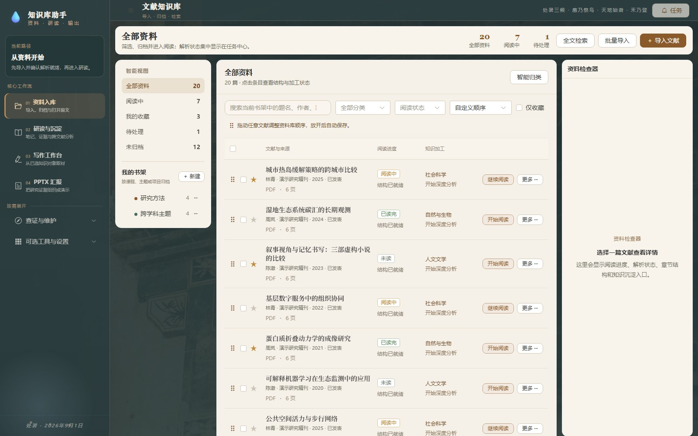
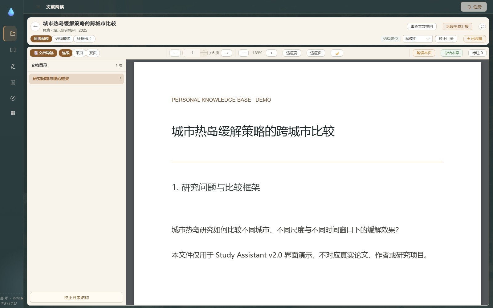
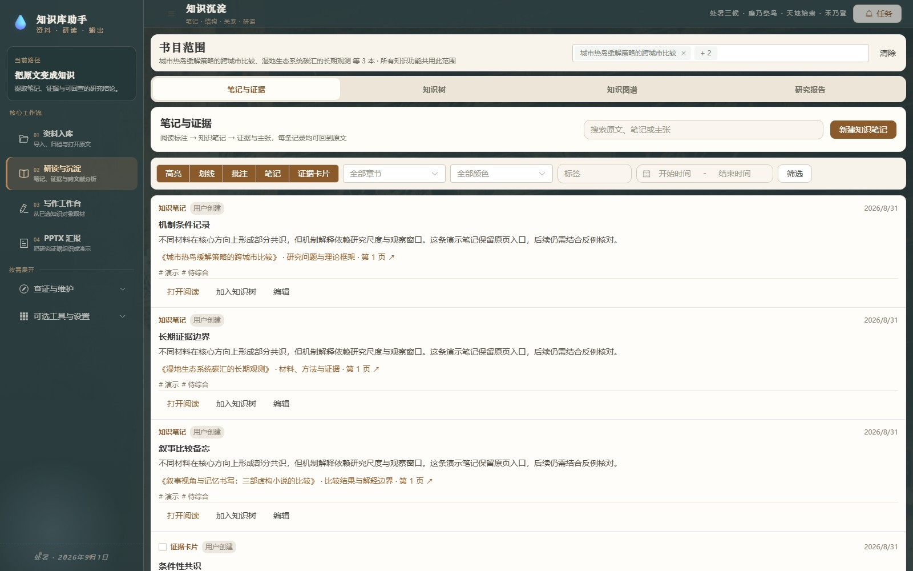
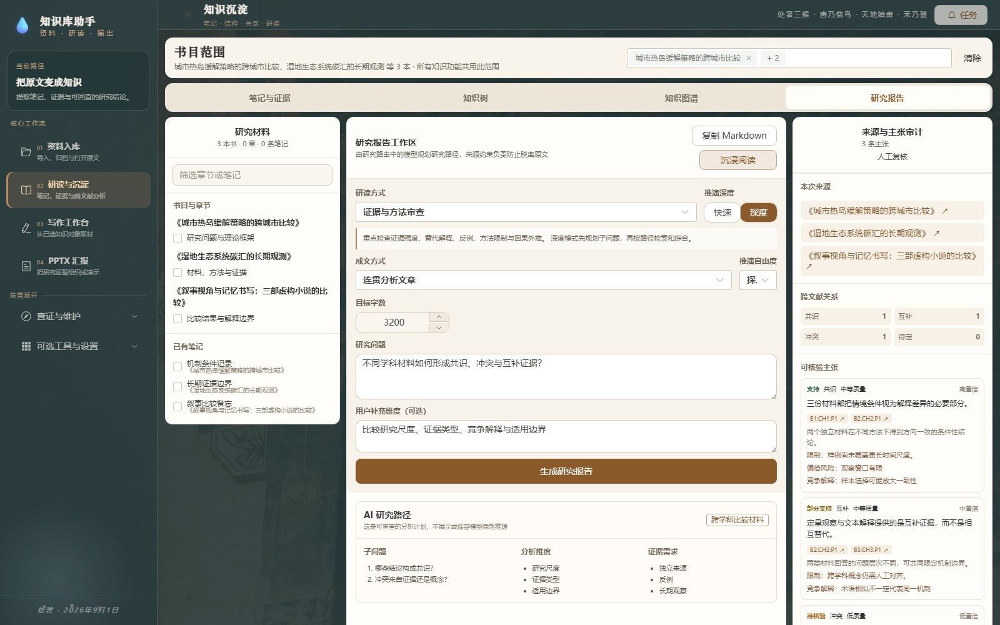
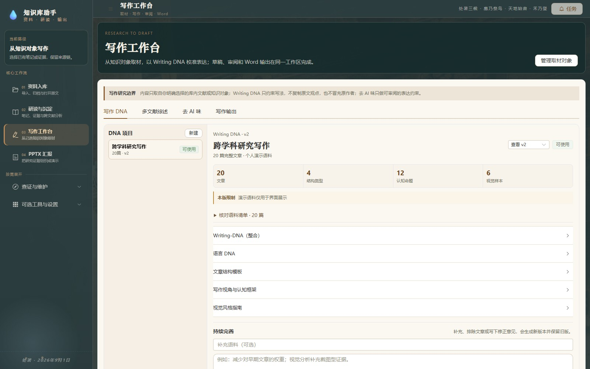
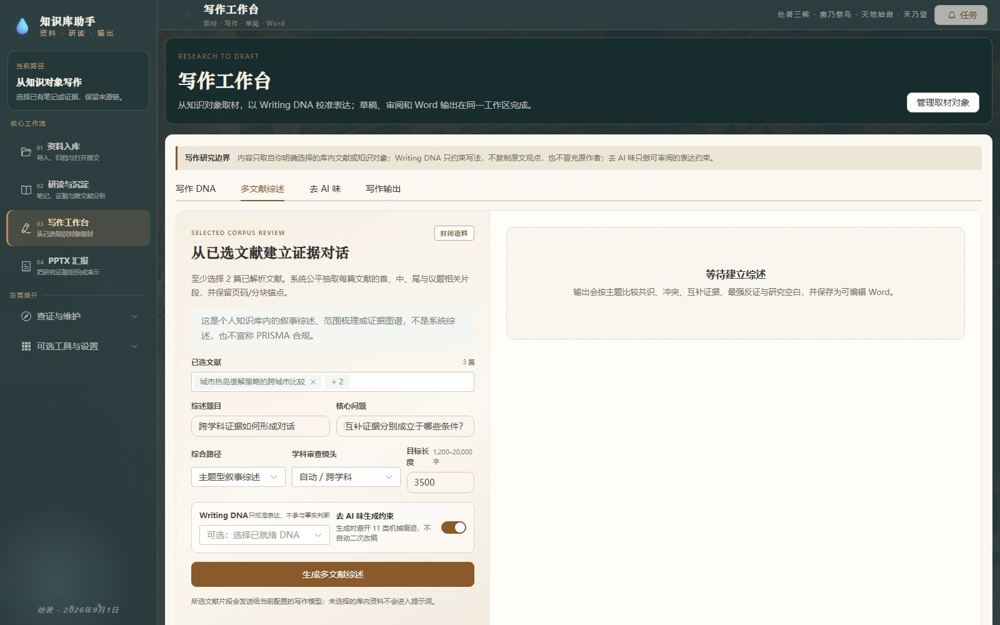
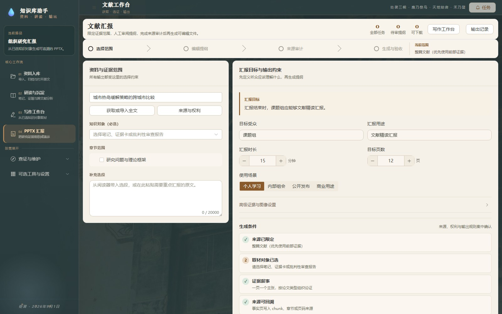

<div align="center">

# Study Assistant · 个人文献知识库

**把散落的 PDF、Word 与 PPT 变成可阅读、可检索、可核验、可继续写作的个人知识系统。**

[](CHANGELOG.md)
[](https://www.python.org/)
[](https://vuejs.org/)
[](https://github.com/boway033-cell/Study-assistant/actions)
[](LICENSE)

[下载最新版](https://github.com/boway033-cell/Study-assistant/releases/latest) · [安装与更新](docs/DOWNLOAD_AND_INSTALL.md) · [产品边界](docs/产品文档.md) · [隐私说明](PRIVACY.md)

本地优先 · 原文证据链 · 跨文献综合 · 写作与 PPTX 输出

</div>



<div align="center"><sub>v2.0.0 真实运行界面；截图全部来自隔离的虚构演示库，不含用户文献。</sub></div>

## 它的核心不是“再做一个 PDF 聊天框”

Study Assistant 服务于一条完整的个人研究链：

> 资料入库 → 可靠阅读 → 证据沉淀 → 跨文献研读 → 写作 / PPTX → 回到原文复核

你仍然决定读哪些资料、采用哪些证据、接受哪些修改。AI 负责整理、比较和提出可审查的解释，不把模型记忆冒充你的知识库，也不会把未选文献混入写作。

| 常见断点 | Study Assistant 2.0 |
|---|---|
| 文件越存越多，找不到当前项目需要的材料 | 多级虚拟书架、筛选、十种排序方式与拖拽自定义顺序；一篇文献可归入多个书架 |
| 扫描件目录混乱，正文被误判为标题 | 原生目录、版面、编号链和 OCR 共同判断；低置信度结果进入可拖拽的目录校正台 |
| AI 给出结论，却无法回到依据 | 文献、章节、页码、文本块和批注保持稳定来源链；机器锚点在成文界面转为紧凑引用 |
| 多篇文献只是轮流摘要，没有真正综合 | 研究报告显式区分共识、冲突、互补证据、竞争解释、偏倚与适用边界 |
| 笔记、报告和写作彼此断开 | 批判性审查可回存为知识笔记和证据卡；写作与 PPTX 强制从已选知识对象取材 |
| 写作太模板化，或被引用编号打断 | 支持连贯分析文章与探索性延伸；Writing DNA 只校准写法，去 AI 味改动逐条审阅 |
| 知识库逐渐损坏但无从发现 | 健康检查识别未解析、低质量 OCR、无目录、无元数据、重复资料与失效锚点 |

## 四个核心工作区

### 01 · 资料库：让文献先变得可管理

- 导入 PDF、DOCX、PPTX，自动建立元数据、目录、文本块和全文索引。
- 用智能视图、书架、分类、阅读状态和收藏缩小范围。
- 按自定义顺序、导入时间、题名、作者、年份、最近阅读或进度排序。
- 在“自定义顺序”下直接拖动文献；全库顺序与每个书架顺序分别保存。
- OCR 显示页级进度，支持取消和无进展超时；重任务统一进入任务中心。

### 02 · 研读与沉淀：每个判断都能回到材料

<table>
  <tr>
    <td width="50%"><br><b>原文阅读与目录校正</b><br><sub>连续、单页、双页、目录定位、高亮、批注与结构精读。</sub></td>
    <td width="50%"><br><b>笔记与证据</b><br><sub>高亮、划线、知识笔记和证据卡分开保存，统一按来源查看。</sub></td>
  </tr>
</table>

- PDF 渲染按可见页调度并限制像素预算，缩放时取消过期任务；失败页可以单独重试。
- 目录支持改标题、页码、层级、顺序、新增、删除和拖拽；保存后原位刷新，不折叠整个工作区。
- 先限定书目范围，再进入笔记、知识树、图谱或研究报告；不选择时不会默认混合全库。
- 知识库问答采用 FTS5、RRF 与可选向量召回，回答携带可回跳来源。



研究报告不是固定模板。模型可以根据材料和问题组织连贯文章、进行受控延伸，同时把事实、解释和待验证推断分开。右侧审计区逐条显示来源、置信度、反例、竞争解释及跨文献关系；人工修订后可沉淀回知识库。

### 03 · 写作工作台：从知识对象到完整文章

<table>
  <tr>
    <td width="50%"><br><b>版本化 Writing DNA</b><br><sub>从 20 篇以上自有完整语料提炼结构、语言和推理习惯；每次完善保留旧版。</sub></td>
    <td width="50%"><br><b>多文献综述</b><br><sub>显式选择 2–50 篇文献，比较共识、冲突、互补证据与最强反证。</sub></td>
  </tr>
</table>

- Writing DNA 只约束表达方式，不提供事实，也不复制原作者的独特表达。
- 独立新作只从已选笔记、证据卡和批判性审查报告取材，允许 AI 在证据边界内形成连贯论证。
- 多文献综述覆盖社会科学、人文与文学、自然科学与生物医学及跨学科镜头。
- 正文使用自然的脚注/引用呈现，内部定位符不直接打断阅读；引用审计仍可回到原页。
- 文本与 DOCX 去 AI 味只处理明确的机械表达，候选修改由用户逐条接受或撤销。
- 草稿可继续编辑并导出 Word，来源变化后会提示重新核对。

### 04 · PPTX 汇报：证据先于排版



- 必须先选择知识笔记、证据卡或批判性审查报告，再设定受众、用途、时长和页数。
- 生成前审阅逐页提纲，生成后检查主张—来源、数字、权利与覆盖率。
- PowerPoint 可用时执行真实逐页渲染与视觉验收；不可自动化时明确降级为结构审计，不伪装成已完成视觉验收。
- 复杂多面板、矢量图和公式页仍需要人工复核，详见[产品边界](docs/产品文档.md#当前边界)。

## 本地优先，但不含糊地描述联网边界

| 数据 / 操作 | 默认行为 |
|---|---|
| 原始文件、SQLite、FTS5、批注、笔记、报告和写作稿 | 保存在本机 `backend/data/` |
| 解析、目录、OCR、健康检查、知识库洞察 | 本机执行 |
| AI 问答、研读、写作、PPTX、出题 | 仅在用户触发后，把所选范围的必要内容发送给对应模型供应商 |
| 页面视觉解读 | 仅在用户触发后发送当前页面图像 |

设置页可分别为问答、研究、写作、PPTX 与通用生成选择连接和回退链。内置 DeepSeek、Kimi、智谱 GLM、通义、OpenAI、Anthropic、Gemini，也支持自定义供应商；没有 API Key 时，导入、阅读、目录修订、全文检索和本地知识组织仍可使用。详见 [PRIVACY.md](PRIVACY.md)。

## 下载与启动

当前 2.0 发布物是**本地 Web 应用包**，不是免安装桌面 EXE。页面在浏览器中打开，但服务、资料和数据库都运行在本机。

最短路径（Windows）：

1. 从 [GitHub Releases](https://github.com/boway033-cell/Study-assistant/releases/latest) 下载 `study-assistant-v2.0.0.zip` 并完整解压。
2. 安装 64 位 Python 3.12+，在项目目录打开 PowerShell。
3. 运行下列命令创建环境并安装依赖：

```powershell
python -m venv .venv
.\.venv\Scripts\python.exe -m pip install -r requirements.txt
```

4. 双击 `start.bat`；首次启动会建立 `backend/data/`。使用 `stop.bat` 停止服务。
5. 在设置页按需添加模型连接。Key 加密保存在本机。

完整的下载选择、源码构建、更新、备份和故障排查见：[安装与更新指南](docs/DOWNLOAD_AND_INSTALL.md)。

## 2.0 的质量基线

- 后端完整测试、前端单测和生产构建由 CI 持续执行。
- 固定检索集覆盖跨学科问答、引用正确性和无答案拒答；容量基线覆盖 3,000 本 / 300,000 文本块合成库。
- 截图脚本只连接临时演示数据库，并在写盘前检查禁止展示词；不会读取用户正式知识库。
- SQLite 适合当前个人中小型资料库。数千本真实文献的迁移阈值仍需更大规模验证，不把合成基线包装为已证明的无限扩展能力。

本地验证：

```powershell
.\.venv\Scripts\python.exe -m pytest -q
cd frontend
npm ci
npm run test:unit
npm run build
```

## 文档

- [产品定位、功能边界与路线](docs/产品文档.md)
- [安装、更新、备份与卸载](docs/DOWNLOAD_AND_INSTALL.md)
- [产品功能地图](docs/PRODUCT_FUNCTION_MAP.md)
- [项目交接](docs/PROJECT_HANDOVER.md)
- [研究报告方法](docs/RESEARCH_REPORT_METHOD.md)
- [容量与检索评测](docs/SCALING_AND_RETRIEVAL_EVAL.md)
- [架构](docs/01-architecture.md) · [API](docs/03-api.md) · [脚本](scripts/README.md)
- [贡献指南](CONTRIBUTING.md) · [安全策略](SECURITY.md) · [变更记录](CHANGELOG.md)

---

<div align="center"><b>以原文为根，以知识为枝；让每次阅读都能进入下一次思考。</b></div>
