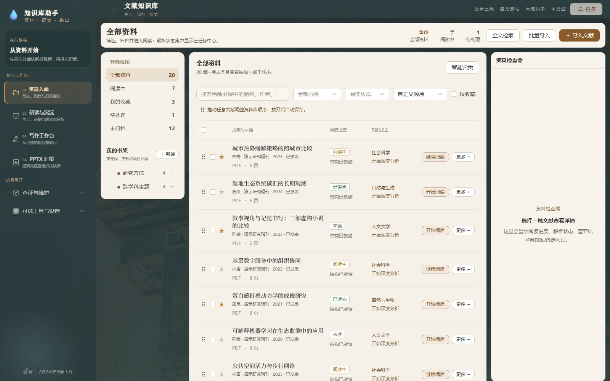
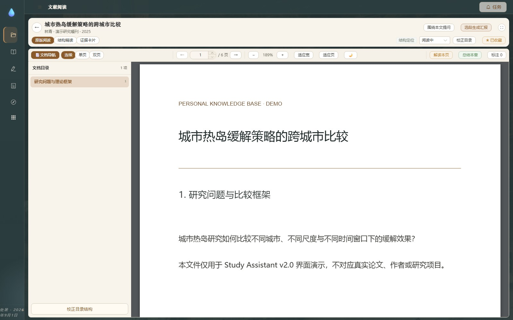
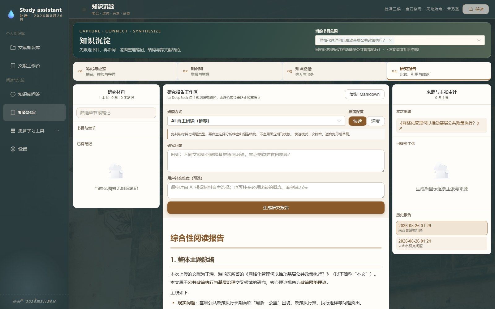
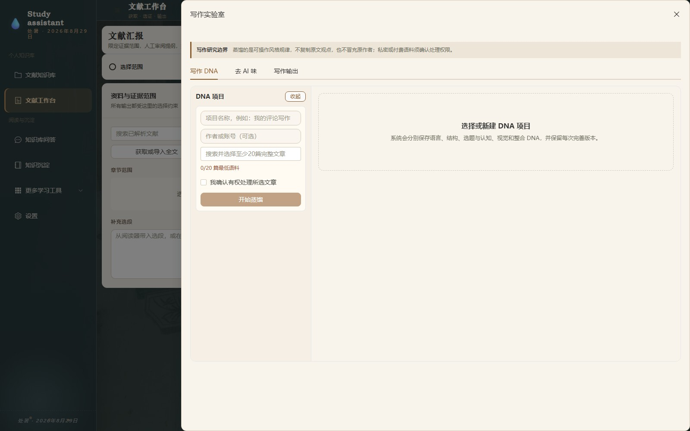

<div align="center">

# Study Assistant

### 从读过一篇，到真正形成自己的判断

本地优先的文献阅读与研究工作台 · 全文论证重建 · 跨文献发现 · 写作与汇报

[](CHANGELOG.md)
[](https://github.com/boway033-cell/Study-assistant/actions)
[](PRIVACY.md)

[认识 2.5](#25-个人知识助手与长书目录) · [开始使用](#开始使用) · [隐私与边界](#隐私与边界) · [变更日志](CHANGELOG.md)

</div>

Study Assistant 帮你把自己拥有的论文、书籍、报告和课件组织为可回溯的研究材料。你可以从原页出发，重建作者如何从问题走向结论，比较不同文献是否真在讨论同一概念，再把尚未解决的张力变成下一步要读、要问、要验证的问题。

**导入资料 → 读原文 → 重建论证 → 对齐概念 → 提出竞争解释 → 回原页修订判断**



<p align="center"><sub>界面示例摄于 2.3.0；其中书目与研究结果为隔离演示库中的虚构样例。新功能以实际安装版本为准。</sub></p>

## 2.5 个人知识助手与长书目录

书架或项目可以作为助手的资料范围。助手按所选资料检索与回答，展示来源，并把研究问题、阅读任务、发现和归档连接起来。AI 输出统一应用中文技术写作规范；多任务调度与可配置的模型接口改善较长任务的处理方式。

长书目录识别会区分印刷目录区、正文标题和数字表格，聚合多页目录并校正有一致偏移证据的 PDF 书签。目录样本库用 4 本大卫·哈维著作及 4 本其他长书复验标题、层级和 PDF 物理页。方法与结果见[目录样本库报告](docs/reports/TOC_CORPUS_REVALIDATION_2026-09-27.md)。

## 2.4 阅读、理解与发现

### 读懂一篇：看清论证如何成立

在阅读器选择“理解这篇”，或进入“研读 → 理解与发现”。系统先估算已解析正文的长度、阅读窗口和模型用量，再逐段处理**全部已提取的正文**，保存可续读的阅读轨迹，分层综合为论证地图。地图展示研究问题、概念、方法或推理、结果、结论及其边界；节点和关系附带短引与原页入口。

这不是把一次切块摘要称为“全文理解”。界面分别显示文本处理覆盖、缺少原页定位的文本块、未抽取到文字的页面，以及仍待人工核对的 AI 判断。扫描页需要先 OCR；图表、公式和版面信息仍应打开原页检查。

你可以选择一个节点用自己的话解释，获得“准确之处、遗漏之处、超出原文之处”的反馈；也可以让 AI 解释该步骤或提出反例。对节点标记“同意、不同意、仍不清楚”，保存解释、触发修订的来源与剩余疑问。处理完全文不等于用户已经理解。

### 比较两篇：先核对概念，再谈分歧

选定两篇已解析文献与一个概念，系统比较术语定义、测量、对象、方法和结论范围，标出可比、部分可比或尚不清楚的关系。只有在依据足够时，才把不同解释整理成发现卡：原页证据、张力、至少两种竞争解释、各自前提、区分性预测和下一步需要的材料。默认保留少量可继续追问的候选，而不宣称“学界首创”。



### 让判断可以反复修改

发现卡与论证节点都保留人工复核状态。原文变化或重新 OCR 后，相关理解资产会提示需要重新核对。AI 给出的解释、由原文直接支持的内容和用户确认过的判断分别呈现，方便在复读时回到未解决之处。

详细设计与当前实现范围见 [AI 理解与深度发现设计](docs/AI_UNDERSTANDING_AND_DISCOVERY_DESIGN_2026-09-25.md)。

## 资料库与研读工作区

PDF、DOCX、PPTX 可导入本机资料库，按书架、目录、阅读状态和收藏管理。阅读器支持连续、单页、双页、目录跳转、位置记忆、高亮与批注；扫描件可按需 OCR。笔记与证据卡保留来源，能够从研究结果返回文献原页。

“研读”集中放置四类任务：**理解与发现、问资料、笔记与证据、研究报告**。问答结合全文检索与可选向量召回；研究报告可按选定材料规划维度，比较共识、张力、反例和竞争解释，输出带来源审计的文章。报告中的主张仍需人工核对，尤其是因果判断、图表解释与跨研究外推。



## 写作与汇报

研究报告可转入**写作 → 作品库**继续编辑；重复打开同一报告会返回原作品，保留人工修改。作品库统一管理独立新作、历史综述、表达修订结果与 Word 输出。“写作工具”提供 Writing DNA 与逐条审阅的去 AI 味功能；DNA 用来约束表达和论证习惯，不能充当事实来源。

写作取材可选择本机知识对象或主动检索 Crossref 书目线索。外部检索结果会标为元数据或摘要级材料，不自动当作全文证据。公文写作有独立流程，所含第三方材料的许可见[第三方说明](THIRD_PARTY_NOTICES.md)。



汇报工作区以笔记、证据卡或研究报告为材料，先审阅逐页提纲，再生成可编辑 PPTX，并保留来源、数字与图像权利检查。真实逐页视觉验收需要本机可用的 PowerPoint 自动化。

## 开始使用

当前版本是 **Windows 本地 Web 应用**：服务在你的电脑上运行，浏览器用于操作。没有免安装桌面 EXE。

1. 从 [GitHub Releases](https://github.com/boway033-cell/Study-assistant/releases) 下载 `study-assistant-v2.5.zip`，完整解压。该附件包含已构建前端，仍需 64 位 Python 3.12+。
2. 双击 `install.bat`，按向导安装依赖并启动；中断后再次运行可继续。`diagnose.bat` 可检查安装状态。
3. 在资料库导入自己的资料，或加载虚构演示资料体验阅读和笔记。使用 AI 功能前，到“设置 → 模型连接”添加自己的供应商连接，并检查任务路由与预算。

从源码安装需要 Git、Python 3.12+、Node.js 22+：

```powershell
git clone https://github.com/boway033-cell/Study-assistant.git
cd Study-assistant
git checkout v2.5
.\install.bat
```

更新前先停止服务并备份完整的 `backend/data/`。详细步骤见[下载与安装指南](docs/DOWNLOAD_AND_INSTALL.md)。

## 隐私与边界

| 操作 | 数据去向 |
| --- | --- |
| 文献原件、批注、笔记、理解资产与输出 | 默认保存在本机 `backend/data/` |
| 本地解析、OCR、全文检索、诊断 | 在本机执行 |
| 主动使用 AI 问答、理解、研究、写作、汇报 | 所选任务需要的文字发送给配置的模型供应商 |
| 主动使用 Crossref 检索 | 检索词和配置的联系邮箱发送给 Crossref |

全文研读可能分批发送所选文献的全部**已提取文字**。调用前可看到范围和估算预算；模型费用及数据政策由供应商决定。未配置模型仍可导入、阅读、标注和搜索本地资料。详见[隐私说明](PRIVACY.md)。

系统不能证明用户已经理解，也不能仅凭库内材料判断学界空白。目录识别、OCR、引用定位、论证关系和发现卡都可能出错。对图表、公式、缺页、质量差的扫描件及重要结论，请回原页复核。跨文献比较仅基于本次选定材料；系统综述所需的全面检索、纳排、质量评价和元分析须另行完成。

## 文档与参与

[2.4 功能归属](docs/reports/FEATURE_CONSOLIDATION_2026-09-26.md) · [研究报告方法](docs/RESEARCH_REPORT_METHOD.md) · [开发交接](docs/PROJECT_HANDOVER.md) · [贡献指南](CONTRIBUTING.md) · [安全策略](SECURITY.md) · [隐私说明](PRIVACY.md)

主项目采用 [MIT 许可证](LICENSE)。随附第三方材料保留各自许可，公文写作部分包含 **PolyForm Noncommercial 1.0.0** 材料；分发或商业使用前请核对[第三方许可说明](THIRD_PARTY_NOTICES.md)。
