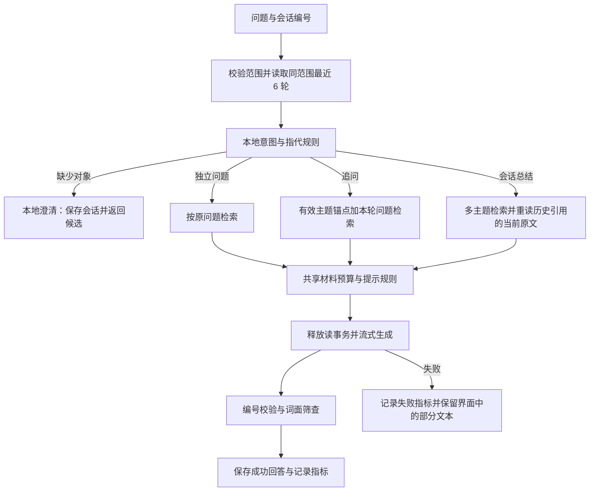

# 多轮问答流程与质量指标

更新日期：2026-10-07。适用于“我的助手”、`POST /api/chat`、书架及项目问答。

## 1. 处理流程



- 英文指代使用词边界，`capital`、`traditional` 中的 `it` 不再被误判。
- 明确的新概念独立检索，短问题不因长度而自动继承旧主题。
- 连续追问跳过没有主题的泛化句；摘要明确区分会话总结与指定资料总结。
- 集合比较的澄清候选包含两个讨论对象。按钮只补充对象，保留原问题；生成期间禁止切换会话或点击其他候选。
- 澄清不读取模型配置、不调用模型，仍保存 `conversation_id` 与历史记录。历史详情恢复候选；模型连接尚未配置时可正常澄清。
- 会话摘要重新读取当前范围内、已解析书籍的原文块，丢弃已删除或越界来源。最多 8 条来源；没有重新核实的历史观点须明确标注。
- 历史答案的旧数字引用被移除，事实按本轮来源重新编号。历史、个人记录与原文中的命令都是不可信输入。
- 提示沿用共享检索构造器的 12,000 字材料预算，为每条来源保留编号、命中片段和部分原文，避免拼接截断导致后续编号没有材料。
- 完成态、模型回退和中文写作规则沿用现有 LLM 通路。显式模型覆盖同时设置 `model` 与旧兼容字段，禁用静默回退；历史保存实际回答的供应商与模型。

## 2. 指标与解释边界

运行期指标使用内存滑动窗口，最多 200 轮，只保留指标和分类，不保存问题、答案或提示词；服务重启后清空。问答历史独立保存在原有数据库表。

| 字段 | 实际含义 | 使用限制 |
|---|---|---|
| `citation_reference_valid_rate` | 有数字引用的成功回答中，编号有效的比例 | 不代表原文支持结论；无引用不参与此比率 |
| `citation_support_rate` / `lexical_match_rate` | 引用附近文字与来源实词重合达到阈值的比例 | 前者保留为兼容字段；仅是词面筛查，不能检测推理、否定或事实错误 |
| `abstention_count` | 含弃答措辞的成功回答数 | 不表示正确弃答 |
| `abstention_precision` | 弃答精确率 | 无人工相关性标签，返回 `null` |
| `abstention_empty_source_rate` | 弃答样本中来源为空的比例 | 空来源与正确弃答不是同一判断 |
| `clarification_count` / `clarification_rate` | 本地澄清数量及占比 | 精确率、召回率仅在有标注的离线集计算 |
| `retrieval_hit_rate` | 成功模型回答中，检索来源非空的比例 | 是非空率，无法证明来源相关；离线 Top-1 指标另列 |
| `history_use_rate` | 追问回答中出现历史主题实词的比例 | 词面代理指标，不能证明模型正确理解指代 |
| `source_redundancy_mean` | 同一本书来源的最大占比均值 | 实质为来源集中度；一本书的不同段落不是重复材料 |
| `failed_count` | 模型或记录保存失败的轮数 | 失败计入总样本和时延，排除成功回答质量分母 |
| `ttft_p50/p95` | 服务收到请求到首个可见正文的时间 | 模型调用样本；不含网络传输与浏览器绘制 |
| `e2e_p50/p95` | 模型轮从请求进入到保存、校验完成的时间 | 含失败模型轮，不混入本地澄清 |
| `local_e2e_p95` | 本地澄清响应的耗时 | 真实测量，不能硬编码为 0 |
| `retrieval_p95` / `rewrite_ms` | 检索及历史解析阶段耗时 | 排查服务端阶段耗时 |

SSE 的 `citation_audit.semantic_status` 保持 `not_checked`；词面筛查另标 `support_method="lexical_overlap_proxy"`。澄清轮为 `not_applicable`。即使词面筛查 100%，否定或错误推理也可能存在，界面提示人工复核。

分位数少于 5 个有效样本返回 `null`。运行期观察门禁总样本少于 5 或字段缺失时返回 `insufficient`；门禁不是产品准确率认证，也不能作为付费模型的性能保证。

## 3. API 契约

- `POST /api/chat`：支持 `book_id` 或 `scope_type/scope_id`，以及 `conversation_id`；范围不能混用。
- SSE `meta`：返回会话编号、范围、意图、查询和澄清候选。
- SSE `done`：返回 `chat_id`、会话编号、实际模型、来源、编号校验、词面筛查与 `qa` 指标。
- SSE `error`：失败时无 `done`，部分文本不保存成成功回答。
- `GET /api/chat/{id}`：保留原字段；本地澄清增加 `qa`，可恢复候选与原问题。
- `GET /api/chat/metrics?window=200`：窗口取值 1–200，返回 `thresholds`、`summary`、`gate`。
- `GET /api/chat/eval`：保留检索统计并附加 `qa` 聚合。

## 4. 固定评测与本次验收

`backend/eval/qa_multiturn.json` v2 含 28 个合成案例，其中 13 个有目标文档、2 个澄清案例、2 个越界案例。使用内存 FTS 与现有重排器，不访问用户资料，不调用外部模型。它验证规则和小型检索链路，不能代表真实长文、各学科或模型语义质量。

```powershell
python -m pytest backend/tests/test_qa_quality.py backend/tests/test_qa_integration.py -q
python scripts/evaluate_qa.py --output .workbuddy/qa-evaluation.json
python scripts/evaluate_retrieval.py --output .workbuddy/retrieval-evaluation.json
cd frontend
npm run test:unit
npm run build
```

独立浏览器验收使用虚构双书书架、单书项目、当前生产构建及真实本地 API/数据库/FTS，模型替换为确定性测试替身。验证提问、连续追问、主题切换、摘要、澄清选择、历史恢复、流中断后的再次提问及项目隔离。桌面 1440 × 1000 与窄屏 430 × 932 检查无页面脚本异常、无横向溢出，长会话输入区留在卡片内。

截图、演示库、模型替身及评测产物保存在忽略目录 `.workbuddy`，不进入提交。本轮未测量真实供应商的时延、费用和答案语义质量；后续应补充真实学科/OCR 材料及人工评判的模型评测。
