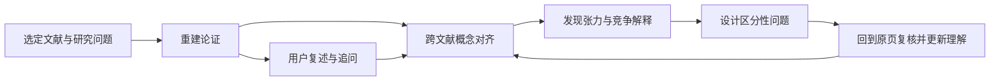

# AI 理解与深度发现设计（2026-09-25）

## 1. 目标与边界

本设计回应 [产品功能审计](reports/PRODUCT_FUNCTION_AUDIT_2026-09-25.md) 第五节，但目标从“生成更深的研究报告”转为**帮助用户形成可修正的理解，并发现值得继续研究的问题**。产物首先是论证模型、概念分歧和研究问题，报告只是这些资产的一种呈现方式。

一次有价值的 AI 互动应让用户能回答三件事：作者到底怎样从问题走到结论；换一个解释或研究设计时，结论还成立吗；接下来读哪一页、找哪种材料或观察哪种现象，最可能改变判断。

产品定位仍是本地优先的个人文献研究工作台。系统只能说“在本次选定材料内发现了一个尚待解释的张力”，不能把库内空白宣称为学界空白，也不能把候选假设写成研究发现。外部元数据与摘要只能提供发现线索，不能替代全文证据。

**与正在进行的工作衔接：**当前工作区的 `api/study.py` 已让 `evidence_needs` 触发选定书目内的候选片段检索，并把状态显示为 `candidate_found/no_candidate`；`api/chat.py` 也已修复引用检查的函数名，且明确将语义支持标成 `not_checked`。本文不重复设计这两项。下面的“理解模型”和“发现卡”可以消费其候选片段，但各自有独立的评测和交付。

## 2. 从 GitHub skills 借鉴的方法

以下是**方法参考**，不是计划直接安装整仓或复制提示词。仓库受欢迎程度不能证明输出正确；只有本产品真实材料上的盲评能证明改进。

| 来源 | 借鉴的具体动作 | 本产品的转化 |
|---|---|---|
| [K-Dense Scientific Agent Skills：critical thinking](https://github.com/K-Dense-AI/scientific-agent-skills/blob/main/skills/scientific-critical-thinking/SKILL.md) | 区分观察与解释、相关与因果、显著性与实际意义；按研究设计审查结论边界 | 针对经验研究生成“论证脆弱点”，而非一个模型自报的总分 |
| [K-Dense：scientific brainstorming](https://github.com/K-Dense-AI/scientific-agent-skills/blob/main/skills/scientific-brainstorming/SKILL.md) | 将想法、假设、预测、证据和决策分开；保留少数观点与负面证据 | 发现卡必须同时列出观察、竞争解释和能区分它们的下一步 |
| [K-Dense：hypothesis generation](https://github.com/K-Dense-AI/scientific-agent-skills/blob/main/skills/hypothesis-generation/SKILL.md) | 候选机制、可证伪预测、测量和边界条件 | 将现有 `hypotheses` 从报告附录变为可继续推敲的工作对象 |
| [DeerFlow：academic paper review](https://github.com/bytedance/deer-flow/blob/main/skills/public/academic-paper-review/SKILL.md) | 按论文类型重建问题、方法、结果、结论的对应关系，并追问每个主张的证据 | 单篇阅读先重建作者的论证，再评价，避免摘要代替理解 |
| [AERS 社科研究技能目录](https://github.com/brycewang-stanford/Auto-Empirical-Research-Skills/blob/main/docs/CONTENT_ZH.md)及其[稳健性技能](https://github.com/brycewang-stanford/AER-Skills/blob/main/skills/aer-robustness/SKILL.md) | 区分识别假设、稳健性、异质性、机制与安慰剂检验 | 社科实证材料走专门的“测量—识别—估计—外推”审查路径；理论与质性材料使用不同路径 |

理解辅助另参考自我解释与检索练习的原始研究：[Chi 等，1994](https://onlinelibrary.wiley.com/doi/10.1207/s15516709cog1803_3)、[Karpicke 与 Roediger，2008](https://doi.org/10.1126/science.1152408)。它们支持“让学习者自己解释、回忆”的设计方向，但不能直接推出本产品的 AI 辅导效果；这需要产品实验。

## 3. 核心体验：从阅读到发现的四个动作

### 3.1 读懂一篇：重建“作者为什么这样想”

阅读器中增加“理解这篇”的轻入口。AI 先生成**论证地图**，每个节点都能回到原页：研究问题、核心概念及其操作化、作者的关键假设、方法或推理步骤、核心结果、作者结论、结论成立的范围、尚未解释处。每条边写明“因为哪段材料，A 才被用来支持 B”。

按材料类型切换问题模板，不把实验论文标准套到所有书和论文上：

| 材料类型 | 应重点重建的关系 |
|---|---|
| 定量经验研究 | 分析单位、样本与对照、变量定义、识别假设、估计量、稳健性、异质性、因果措辞 |
| 质性研究 | 案例选择、访谈或田野材料、编码与解释过程、反例、研究者位置、可迁移边界 |
| 理论或思想文本 | 概念定义、前提、推演链、与竞争理论的分歧、可观察含义 |
| 综述/政策报告 | 搜集范围、纳排与归类口径、来源层级、综合规则、遗漏风险 |

读完地图后，系统只问一个针对关键薄弱环节的问题，例如“如果把这里的‘自主性’改成工作时间控制权，作者的结论还一样吗？”用户先作答，AI 再指出其回答与原文相符、遗漏或超出之处，给出原页和下一步阅读建议。用户可以选择“解释给我听”“让我试着解释”“给我一个反例”。“已处理字符数”与“用户已理解”在 UI 中始终分开。

### 3.2 读懂多篇：先对齐概念，再寻找真正的分歧

现有报告能给 `consensus/conflict` 标签，但不同作者常使用同一词指不同对象，也可能使用不同词表达同一机制。直接把结论相反的句子配对，会制造假冲突。

跨文献比较先生成**概念对齐表**：术语、原文定义、测量指标、分析单位、时间/地点、研究对象、方法、结论方向、相关页。关系只分为“可比较”“部分可比较”“不可比较/尚不清楚”，每个判断都有理由。对齐后才形成张力卡，分类为：事实结果相反、机制解释不同、适用范围不同、测量口径不同、方法假设不同、规范立场不同。后四类通常比简单的“谁对谁错”更能启发新问题。

### 3.3 深度发现：把张力变成可改变判断的提问

每张**发现卡**回答六个问题：

1. 在哪些原页看到了什么现象或论点？
2. 为什么它与原有理解产生张力？
3. 至少两种竞争解释是什么，各自依赖什么前提？
4. 如果解释 A 成立而 B 不成立，应该看到什么不同的证据？
5. 当前所选材料已经回答了多少？下一步最值得读哪页、找哪类资料、或检验哪项数据？
6. 哪些判断只是 AI 提议，哪些由用户确认？

候选来源可以是：跨文献机制不一致、同一概念在不同群体/时期失效、主张与图表/案例不合、结论依赖未经检验的识别假设、被忽略的负例、跨领域概念迁移。候选应先去重与规范化，再按**证据定位、问题清晰度、区分性、可行性和用户兴趣**排序；不要输出“创新分 92”或“学界首创”。默认只展示 2–3 张高价值卡片，允许用户追问或归档。

**示意，以下是虚构材料，不代表真实研究结论：**两篇平台劳动研究分别称“算法透明提高自主性”和“算法透明增强自我规训”。系统不应立即判定冲突，而要先发现第一篇的“自主性”指排班选择、第二篇指任务执行中的裁量权。由此提出的区分性问题是：透明度是否同时提高排班选择、却降低任务执行裁量？下一步需要同一研究中的两类测量或可比较的访谈证据。

### 3.4 让理解持续修正

用户可以在论证节点或发现卡上标记“我同意”“我不同意”“尚未看懂”，输入自己的解释。系统保存**理解修订记录**：原判断、触发修改的来源、修改后的判断和仍存疑处。复读时优先展示曾误解或尚未解决的节点；不是反复生成同一份摘要。

## 4. 可靠性约束：发现必须能被追问

每个内容单元都标明 `source_observation / author_interpretation / ai_inference / research_idea / user_judgment`。它们可以出现在同一张卡中，但不能互相升格。锚点有效、原文支持、方法评价、学界新颖性分别记录，任何一项都不能由另一项自动推出。

最低记录字段：`book_id`、`chunk_id`、页码与原文件版本、相关短片段、OCR/图表读取状态、材料层级（全文/摘要/元数据/用户笔记）、模型和提示词版本、人工复核状态。若涉及图表或公式，仅靠文本抽取不足时标“需查看原页”，可调用现有视觉入口辅助解释，但视觉描述也要保留页码和不确定性。全文变更或重新 OCR 后，关联卡标“来源已变化，待复核”。

系统对新问题默认采用三档状态：`有依据的张力`、`可探索的猜想`、`材料不足`。只有用户或独立核验步骤确认过的主张才能显示“已复核”；模型自审的 `supported` 仍显示为“AI 初判”。社科因果判断要显示识别假设和反事实比较；质性判断要显示案例与解释路径；不以统一的“高质量”标签覆盖这些差异。

## 5. 与现有系统的最小接入

| 层 | 复用 | 新增 |
|---|---|---|
| 材料与锚点 | `Chunk`、原页阅读、`BookDeep`、现有来源锚点 | 论证节点到短片段的定位和原文件版本指纹 |
| 检索 | `rag/retriever.py` 的书目范围检索、当前证据需求候选 | 为概念定义、负例、区分性证据分别发起受范围约束的检索；每次记录命中/未命中 |
| 研究资产 | `StudyReport.claims_json`、`EvidenceCard`、现有 `hypotheses` | `ReadingModel`、`ConceptAlignment`、`DiscoveryCard`、`UnderstandingAttempt`；与既有报告关联而不复制正文 |
| 界面 | `ReaderView` 原页回跳、`StudyView` 审查侧栏 | 阅读器中的论证地图与一次一问；研究页中的概念对齐、发现卡和人工确认 |
| 任务与成本 | 现有后台任务、进度、取消、模型路由 | 单篇理解按需生成并缓存；跨文献发现需显式选择范围、估计材料量和调用预算 |

建议把“理解/发现”实现为可版本化的独立服务流程：`classify_material → reconstruct_argument → verify_anchors → elicit_user_explanation → align_concepts → generate_tensions → formulate_discriminating_question`。每步使用明确的结构化 schema，失败只重试该步；中间对象可查看、可人工改正。无需等待整套研究报告完成，也不依赖正在开发的补检索功能上线。

## 6. 首个可验证的产品切片

**切片 A：单篇理解。** 选一篇文献，生成 6–10 个有原页锚点的论证节点，用户复述其中一个关键关系，AI 反馈其解释中的遗漏或外推。先支持文本质量良好的论文，扫描件与复杂图表明确标注限制。输出存入可编辑阅读卡。

**切片 B：双篇张力。** 用户选两篇材料和一个概念，系统先展示概念是否可比，再给最多两张发现卡。每卡必须有双方原页、两种解释、一个区分性问题和一个下一步。用户能把卡片标记为“有价值/伪冲突/不清楚”，作为后续评测样本。

**切片 C：研究问题工作台。** 把用户确认的发现卡提升为项目中的候选问题，接到现有证据卡、假设和报告。支持“如果这个解释是错的，会观察到什么”“哪个证据最可能改变我的判断”等追问，不自动宣称假设已证实。

前两个切片即可回答产品方向是否有效；切片 C 在用户确实愿意保存并继续追问时再投入。

## 7. 评测：测理解和发现，而非字数

先用脱敏材料制作跨学科小样本：定量社科、质性研究、理论文本、自然科学论文，包含表格、相反结论、不同概念口径、缺证据和 OCR 错误。由至少两名熟悉材料的人标注论证关系与可接受的边界；对分歧保留异议，不强行做单一标准答案。比较本产品现有摘要/报告体验与新切片，而不是只做新提示词自评。

| 指标 | 具体测法 | 不能混用的指标 |
|---|---|---|
| 论证重建正确率 | 人工判断问题→方法→证据→结论的边是否被原文支持 | 锚点编号合法率 |
| 理解增益 | 用户阅读前后用自己的话解释机制，并回答一题新情境迁移题，盲评解释质量 | 自称“看懂了”或停留时长 |
| 伪冲突率 | 人工检查系统标出的分歧是否由概念、对象或方法不一致造成 | `conflict` 标签数量 |
| 发现有用率 | 研究者盲评问题的清晰度、区分性、可行性，记录是否实际追读/采纳 | 生成卡片数量、措辞新奇度 |
| 校准与可靠性 | 缺证据时正确标“材料不足”；图表/OCR 错误的发现率；来源变化后的失效提示 | 模型自报信心 |

切片上线前设置硬门槛：不得把摘要/元数据伪装成全文页码证据；不得显示无来源的“已复核”标签；候选发现须能回到相关原页；“概念不可比”必须允许成为最终结果。数值阈值待基线盲评后确定，避免凭空设定准确率承诺。

## 8. 决策建议

优先做**单篇论证重建 + 用户复述反馈**，验证产品能否提升理解；随后做**双篇概念对齐 + 区分性提问**，验证能否带来真正的新研究方向。现有补检索、引用检查和报告生成继续作为共用基础设施，但不作为本设计的交付中心。成功标准是用户能更准确地解释材料、指出结论何时失效，并愿意沿着发现卡继续查证。

## 9. 2026-09-26 实现深化：从抽样片段到全文层级阅读

原单篇流程只按位置抽取最多 24 个文本块，再一次生成论证地图。长文中未抽中的正文不会被模型读取，因此只能称为抽样阅读。现改为以下分层流程：

1. 按原文顺序遍历全部已解析的非空 `Chunk`，沿章节边界拆成有字符上限的阅读窗口；过长文本块继续分段，不直接截断。
2. 每个窗口独立提取带原页短引的局部论点，并标记正文、前置部分、参考文献等角色；正文没有有效短引时重试，仍失败则整次任务失败，不伪称覆盖完整。
3. 将局部论点按有界上下文逐层合并；合并只能引用上一层已经核对存在的短引。全篇论证地图在最后生成，逐段阅读记录保留给用户检查。
4. 保存全体文本块及原文件哈希的版本指纹。正文、章节、页码或原文件版本变化后，旧资产提示失效。
5. 为基于全文理解的追问提供解释、批判性审查与教学式回答；先使用全篇论证及逐段记录，再在同一文献内找回与问题相关的原始段落，以补足层级压缩遗失的细节。每个生成段落都须有可回原页的短引，材料不足之处单列。
6. 每完成一个阅读窗口就保存与全文指纹绑定的检查点。后段失败时可从已完成窗口续读；原文变化后不复用旧检查点。

方法上吸收了上述 skills 中“先逐段理解再评价”“区分观察、作者解释与 AI 推断”“按材料类型审查证据和竞争解释”的做法；没有把第三方仓库代码或整套提示词复制进产品。系统显示处理字数、文本块、窗口、原文件缺字页和预算估算；**处理全部已抽取文字不等于读到了扫描页、图表或公式，也不等于模型正确理解，更不等于用户已经理解**。语义支持仍为 AI 初判，须回原页核验。
