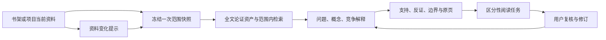

# 项目理解档案与深度研究助手：实施方案

日期：2026-09-26

## 目标与现有基础

目标是让用户在一个书架或研究项目中持续修订判断：每个问题、概念、解释和阅读建议都有当时的资料范围、原文依据及后续修订记录。交付物是可复核的研究过程，不是自动生成一份更长的摘要。

当前开发区已有 `AssistantProject`、`AssistantMemory`、书架/项目范围解析、范围内问答、逐本全文研读状态，以及带来源版本的 `SensemakingArtifact`。本方案沿用这些对象和现有任务队列；不复制 PDF，不把 AI 输出自动写成用户观点，也不依赖新增云服务。

## 一、数据与可复现性

新增四张表，不改动现有书架、文献和理解资产的主键：

| 表 | 关键字段 | 用途 |
| --- | --- | --- |
| `research_scope_snapshots` | `id`、`scope_type`、`scope_id`、`shelf_ids_json`、`book_versions_json`、`digest`、`created_at` | 冻结一次任务的书目集合。每本记录 `book_id`、原文件哈希、已解析正文摘要哈希、块数和当时书名；快照不可改写。 |
| `research_items` | `id`、`snapshot_id`、`kind`、`concept_key`、`statement`、`detail_json`、`origin`、`review_status`、时间 | 保存研究问题、概念义项、竞争解释、判断和阅读任务。`origin` 区分用户输入与 AI 提议；`concept_key` 支持跨书架查找。 |
| `research_evidence` | `id`、`item_id`、`book_id`、`chunk_id`、页码、短引、块哈希、`relation`、`review_status` | 记录“支持、挑战、定义、限制、尚不明确”的原文关系。打开时重新校验块及其版本。 |
| `research_revisions` | `id`、`item_id`、`before_json`、`after_json`、`trigger_evidence_id`、`actor`、`created_at` | 只追加修订，保留原判断、改变它的来源和仍存疑处。 |

范围快照使用现有 `resolve_scope` 获取书目，并复用 `sensemaking.document_digest` 校验已解析正文。书架成员增删不会改变旧快照。再次进入项目时显示“当前范围较本次判断增加/移除/更新了哪些书”，由用户决定是否基于新快照继续分析。若文献被删除或重新 OCR，旧记录仍可读，但原页入口显示“来源失效/待复核”，不静默用新文本替换旧证据。

历史证据保留书目与文本块编号作为定位线索，不设置会随文献删除而级联清除历史的外键。项目删除由服务层明确删除该项目档案；每个按 ID 访问的接口都重新校验记录所属范围，不能靠前端传来的 `snapshot_id` 决定权限或资料范围。

每条结论必须同时保存 `origin`、`review_status` 和证据关系。`AI 提议`、`用户确认`、`来源已变化`是三个独立维度；引用编号存在只能说明定位有效，不能自动证明语义支持。

## 二、三次可独立交付的开发迭代

### 迭代 A：项目理解档案与范围快照

1. 在 `backend/app/models/__init__.py` 增加四张表和索引；新增表用现有启动建表流程创建，不重写旧数据。服务层放在 `backend/app/services/research_archive.py`。
2. 扩展 `/api/assistant`：
   - `POST /research/snapshots`：输入 `scope_type/scope_id`，返回固定书目及版本摘要。
   - `GET /research/snapshots/{id}/diff`：比较该快照与当前书架/项目范围。
   - `GET/POST /research/items`、`PATCH /research/items/{id}`：读写问题、判断、解释；用户确认与普通文本编辑分开记录。
   - `POST /research/items/{id}/evidence`、`GET /research/items/{id}/revisions`：链接原页并查看修订历史。
3. “我的助手”在选择书架或项目后增加“项目档案”面板，按“研究问题—当前解释—支持/挑战证据—未解决问题”展示。用户可从问答引用或论证节点显式加入档案；AI 建议先进入待复核区。

**验收：**增删书架成员后旧判断的资料范围保持不变；新旧范围差异可见。重做 OCR、修改文本块、删除文献后，引用状态准确变化。用户删除项目时按现有删除语义清理该项目档案，不影响原书架及文献。

### 迭代 B：跨书架概念追踪与主动寻找反证

1. 从当前快照内有效的 `SensemakingArtifact` 和原文块提取候选义项：原词、作者定义、操作化/测量、研究对象、时间地点、方法、结论范围。模型只提议；服务端核对 `book_id` 属于快照、短引确实出现在对应文本块、页码可定位、来源版本未变。
2. 先按标准化术语召回，再让 AI 给出“相同/部分相同/不同/材料不足”及理由；不同词表达相近机制时允许用户手动归并。保留各作者原词，不把词典归一化当成学术等价。
3. 用户写入判断后，生成多种检索问题：相反结果、边界条件、反例、替代机制、方法限制、图表与正文不一致。检索严格限于快照书目，并尽量覆盖不同文献；结果标成“候选反证/候选限制”，用户核对后才影响当前判断。找不到时显示“本次范围未找到”，不声称不存在反证。
4. 页面在同一张概念卡中并列显示各书架的义项与页码、可比性理由、支持材料、挑战材料和未解决差异。

**验收：**同词异义、异词同义和不可比较三种案例均能正确保留差异；越界书目不能进入候选；AI 引用虚构页码或不在块内的短引会被拒绝保存。重新 OCR 后旧义项提示复核。

### 迭代 C：区分性阅读建议与研究设计陪练

1. 对每个有两种竞争解释的判断，分别记录其前提和可观察预测。生成“若 A 成立而 B 不成立，应看到什么”的问题，并先检查快照内哪些原页可能回答；没有对应原页时明确建议找哪类外部资料或数据。
2. 阅读任务按“能否改变判断、原页是否可达、当前证据缺口、用户关注程度”排序；默认只给 1–3 项。用户打开原页后选择“支持 A、支持 B、两者都不支持、仍不清楚”，触发修订记录。
3. 复用全文研读给出的材料类型：定量研究追问测量、对照与识别假设；质性研究追问案例、反例与解释过程；理论文本追问概念前提和推演链；综述追问纳排范围。每轮只问一个具体薄弱点，反馈区分“原文如此说”“用户推断”“AI 建议”。
4. 长任务使用现有后台任务队列、模型路由和预算提示；先展示本次书目范围和预计用量，再由用户启动。失败保留已确认的档案，不覆盖人工修改。

**验收：**建议能打开对应页，或明确标为“需找新资料”；不因没有材料而伪造区分性证据。定量、质性、理论、综述四类样例使用不同追问。用户再次打开项目时优先看到未解决和来源已变化的任务。

## 三、接口与页面边界

- 现有 `/api/chat` 保持普通问答；项目档案的读写和分析放在 `/api/assistant/research/*`，避免一次聊天自动改变长期研究状态。
- 分析接口统一返回后台任务 ID；最终结果经结构化校验后进入待复核区。保存用户确认、撤销确认和编辑判断均追加 `research_revisions`。
- 新界面进入现有“研读 → 我的助手”，不新增一级导航。阅读器与“理解与发现”只提供“加入项目档案”和“返回原页”的轻入口。
- 项目可以引用多个书架；跨书架概念追踪只看当前快照。全库探索必须由用户明确选择范围。
- AI 分析沿用用户配置的研究模型及现有预算机制；若配置的是云端模型，提交前说明本次选中材料会发送给该供应商。前三次迭代没有本地训练的硬件要求。

## 四、质量门槛与测试材料

建立一套不进入用户数据库的固定样例：同词异义、异词同义、相反结果、不同适用范围、未经检验的识别假设、被忽略负例、OCR 重做、书架成员变化、来源删除。每例有预期原页和可接受的“材料不足”结果。

自动测试锁定：范围无越界、快照不可变、来源版本失效、引用短引校验、AI 提议不能成为用户确认、修订不可覆盖、重复后台任务不重复写入。前端测试覆盖旧快照差异、候选反证状态、原页跳转和复读入口。模型质量用留出文献的人工盲评比较现有助手与新流程，分别记录原页定位、概念可比性、反证是否相关、区分性问题是否真能改变判断；没有提升时保留旧流程。

首个端到端演示使用两篇**虚构**平台劳动材料：一篇把“自主性”定义为排班选择，另一篇讨论任务执行裁量。用户主张“两篇结论冲突”时，档案先显示定义只部分可比，再给出“透明度是否同时提高排班选择、降低任务裁量”的区分性问题；两条定义均能打开原页。用户改判后，旧判断、触发它变化的页码和剩余疑问都能从修订历史找回。

## 五、本地训练的位置

前三次迭代不修改模型权重。它们会产生可审计的“用户问题—原文依据—用户修订”样本。只有在用户主动选择、语料处理权利明确、具备本地可训练模型和硬件，并通过按整本文献划分的留出评测后，才增加可选的本地适配器。训练目标是引用、反证和研究方法判断的操作方式；文献事实仍从当前版本资料检索。训练产物与用户文献都只保存在本机数据目录，并提供删除入口。

## 开工顺序

先完成迭代 A 的范围快照、证据链接和修订历史，再接迭代 B 的候选概念与反证，最后接迭代 C 的阅读任务与陪练。每一迭代都能单独使用和回归，不需要等待本地模型训练。当前书架/项目助手代码尚在开发工作区，落地时先以其通过测试的版本为基线，保留已有未提交改动。
