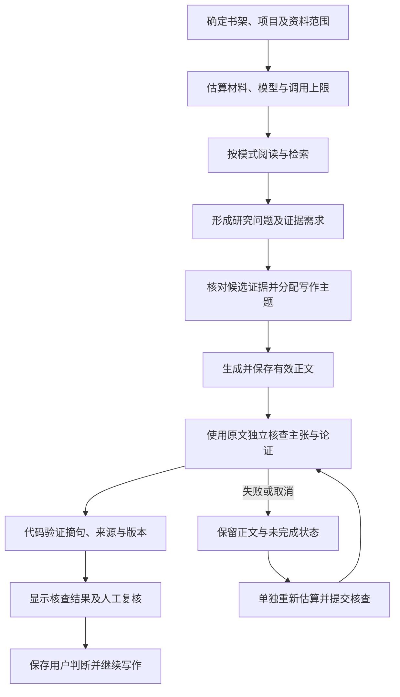

# AI 通路研究与实施报告

日期：2026 年 10 月 7 日。

目标：让助手持续使用用户明确选择的书架、项目和资料，形成能检查来源、保留成果、修订判断的工作流程。本轮结合已有代码审计，阅读公开产品文档与研究，完成原文核查及独立重试通路。检索质量、语义理解、表达质量和运行可靠性分别评估。

## 1. 这些问题已有公开方案

| 现有问题 | 已公开的方法 | 对本产品的启示与本轮取舍 |
| --- | --- | --- |
| 引文编号能定位，但引文可能不存在或不支持结论 | NotebookLM 系列产品允许选择来源，并通过引文查看原句和上下文；保存笔记时保留引用。[官方帮助](https://support.google.com/gemininotebook/answer/16179559?hl=en) | 原始材料回跳和主张核查放在报告工作区；正文引文、实际摘句、支持性判断分别保存。本轮补充原文摘句核对，不增加独立工作区。原 NotebookLM 帮助链接在本次核查时跳转至 Gemini Notebook。 |
| 文本切块丢失章节语境，检索出来的片段缺乏指代信息 | Anthropic 的 Contextual Retrieval 为片段补充上下文，并结合词法检索、向量检索与重排。[原文](https://www.anthropic.com/engineering/contextual-retrieval) | 当前已有词法与可选向量检索，先保证范围、锚点和容量分配正确；后续在真实书目评测上比较章节路径和上下文补充。尚未实现该论文式索引或重排，不把厂商实验收益当作本产品结果。 |
| 检索有结果，却缺乏足够相关或可信的证据 | Yan 等人的 Corrective RAG 使用检索评价器决定后续修正动作。[2024 年论文](https://arxiv.org/abs/2401.15884) | 借鉴“先评价，再决定补取或收缩判断”的思路。已有证据需求检查只表示找到了候选；本轮进一步用原文核查成稿。未实现完整 CRAG，未引入论文中的自动网络扩展。 |
| 最后一轮失败导致重跑全文，重复耗时和付费 | LangGraph 通过持久化状态和检查点支持失败恢复，并说明内存保存不能跨重启。[持久化文档](https://docs.langchain.com/oss/python/langgraph/persistence) | 复用现有 SQLite 和任务队列：完成正文先入库，核查保存状态；失败后只重跑核查。本轮没有迁移到 LangGraph，也未实现全文每一批研读的自动断点续跑。 |
| 提示词越加越多，难以判断质量有没有提高 | OpenAI 的评测指南强调按任务建立数据集、记录错误，并用人工判断校准自动指标。[评测指南](https://developers.openai.com/api/docs/guides/evaluation-best-practices) | 本轮新增可重复的错误引文、错误数字、来源变化和恢复测试；下一步再使用人工标注的真实书目比较模型和提示词。没有接入托管评测服务。 |

这些方案说明相关问题可以拆解并逐项处理；公开实验或功能文档不能证明某种方法已解决所有材料中的理解与幻觉问题。选用方法仍需结合本产品的资料类型、模型和成本验证。

## 2. 本次代码审查发现

1. **来源定位与引文真实性之间存在缺口。** 有效的 `B…:C…` 锚点只证明片段存在；模型仍可能给出片段里没有的数字、引语或总结。
2. **压缩笔记不能代替原文核查。** 全文分批研读适合形成提纲和主题线索，但最终检查应回到所选范围的原始片段。
3. **短报告与长报告的核查不一致。** 原通路长报告有单独审计，短报告依赖生成过程内的自判；核查失败没有统一状态和独立恢复入口。
4. **正文保存时机偏晚。** 完成成文后，仍要等待核查才入库；进程中断或取消会影响已完成成果。
5. **人工修订与自动核查需要明确写入规则。** 后台返回得更晚的 AI 判断不能覆盖用户已经保存的复核结果。

历史任务日志中还存在 DNS、SSL、网络读取和首字等待失败，以及“全文逐段阅读后仍不足三条可定位论点”的记录。这些记录来自此前运行，不能据此宣称当前模型延迟仍为某个数值。本轮未调用付费模型测量速度。

## 3. 改进后的通路



### 3.1 原文核查

- 核查输入从数据库取回实际原文或用户笔记，不使用阅读摘要冒充原文。
- 检查书目范围、文本块所属书目、章节与页码。仅有书名或章节标签不能作为片段证据。
- 优先使用成稿引用的片段，最多 24 段、合计约 26,000 字；过长片段明确标注中部省略。正文核查输入最多 40,000 字，模型最多提取 12 条关键主张。
- 模型判断事实、解释与综合推断的关系，指出跳步、重复、竞争解释、因果外推及超出证据的结论。
- 模型返回短引文后，代码再检查文字是否存在于实际提交的片段；容忍排版空格、换行、引号及常见标点差异，保留数字、负号、小数点和否定词。
- 没有匹配摘句的主张降为 `needs_review`；部分来源未匹配时不能保留完整支持标签。“共识”至少需要两本资料的匹配证据，不能用同一本书的多个片段充数。
- 用户笔记明确标注为笔记，不据此认定书籍原作者表达了相同结论。

**摘句存在不等于结论成立。** 文字匹配负责检查引文真实性，模型负责提出支持性初判，用户负责最终复核；所有自动核查主张保留人工复核要求。核查覆盖数量可见，不把有限片段核查表示成全文证明。

### 3.2 保存、恢复与并发

有效正文、引用对应表、原文片段指纹和初始核查状态在最后一轮调用前落库。核查出错时保留正文；取消和进程中断也不会删除已保存报告。没有正常结束的核查显示可重试状态。

新增 `study-audit` 后台任务及两个接口：

```text
POST /api/study/reports/{report_id}/audit/estimate
POST /api/study/reports/{report_id}/audit
```

单独核查先展示模型、材料量和估算用量，再绑定用户确认的 Token、调用上限与模型路由签名。正常核查预计 1 次调用；失败重试仍受任务预算限制。模型路由变化时拒绝沿用旧预估。

同一报告正在核查时拒绝重复提交；任务队列也按主资料和任务类型原子预留。同一本主资料的多个报告核查会被保守地串行限制，其他类型任务继续使用既有队列与供应商并发控制。

来源被修改、重新解析或删除时拒绝继续使用旧快照。旧报告首次核查没有历史指纹，只能用当前原文，界面明确提示无法验证生成时来源版本；该提示在后续核查中保留。

### 3.3 人工复核与页面安排

“来源与主张审计”区域增加单独重跑按钮、核查状态、原文摘句和论证检查。使用已有研究报告页面与全局任务中心，不增加导航入口。正常正文写作与来源核查分别显示成果。

已人工复核的主张保持原值，新 AI 判断作为建议单独展示；核查期间发生人工编辑时拒绝覆盖。机器匹配元数据只在主张与来源未被修改时保留，不能通过客户端伪造验证标签。

## 4. 与此前修复一起交付的基础能力

本次 Git 交付也包含此前已完成、尚待提交的代码审计修复：任务完成状态统一；三种模型协议的流式终止与输出上限检查；思考增量预算；模型路由固定；长文续写及接缝去重；章节层级与正文共同参与缓存键；证据需求检查与跨来源容量分配；目录修改后保留旧成果并标记失效；范围检索和原子任务去重。详细历史审查见 [9 月 29 日复审报告](CODE_REAUDIT_AI_2026-09-29.md)。

## 5. 验证与实际限制

本轮使用隔离 SQLite、模拟模型流和现有回归样本。最终自动回归为 `488 passed, 1 deselected`；独立运行真实 Office 集成检查为 `1 passed`。前端单元测试 `92 passed`，生产构建通过，`git diff --check` 通过。

后端常规回归命令为 `python -m pytest -q backend/tests -k "not test_real_powerpoint_render_when_available"`；真实 Office 检查单独执行 `python -m pytest -q backend/tests/test_literature_workbench.py::test_real_powerpoint_render_when_available`。整套测试同跑时曾出现一次真实 PowerPoint 预览失败；独立检查和使用同一 PPTX 的后续真实预览均成功，偶发预览问题尚未完成归因，不能表述为所有环境问题已消除。

全量回归还触发了本机真实 PowerPoint 的 PDF 导出问题：固定格式方法参数绑定失败后没有执行回退。现已补充 PDF 另存回退、UTF-8 脚本签名和明确的子进程输出编码，单项真实 Office 导出已复测通过。格式值和编码要求分别依据 [Microsoft SaveAs 文档](https://learn.microsoft.com/en-us/office/vba/api/powerpoint.presentation.saveas)与 [Windows PowerShell 字符编码文档](https://learn.microsoft.com/en-us/powershell/module/microsoft.powershell.core/about/about_character_encoding)。

新增用例覆盖：锚点正确但引文虚构、数字改变、否定或范围改变、合理排版差异、跨书目及错误页码、正文先入库、取消与协程中断、失败后只重跑核查、人工结果保护、生成期间编辑、来源修改、模型与预算绑定、旧报告版本提示。

以下能力仍有明确边界：

- 没有真实付费模型的端到端调用，不能承诺延迟、账单或语义准确率已有提升。
- 短报告新增一次独立核查，会增加模型耗时和用量，预估已包含该调用；单独重试可减少失败后重复成文，但收益需要实际计量。
- 原文核查使用有限片段，不覆盖每句正文及所有可能反证；模型自评可能有偏差。
- 中文排版与格式校正无法自动修复 OCR 识别错字；未匹配的引文保留待人工核对状态。
- 全文阅读仍未实现每一批内容的自动跨重启续跑；正文保存与核查恢复已实现。
- 本地字符折算预算与供应商实际 usage、费用不同，仍需接入实际用量记录。

## 6. 下一步开发顺序

1. **建立真实书目质量评测。** 复用大卫·哈维等现有书目样本，人工标注问题、对应页、核心主张和反证；先覆盖跨书比较、证据稀疏、因果外推、概念差异、OCR 及长文重复六类场景。比较引文正确率、主张支持率、反证遗漏率、段落重复率和人工修订量。
2. **量化耗时与费用。** 为阅读、检索、成文和核查记录耗时、实际供应商 usage、重试与缓存命中。用首字等待、总时长和每份可用报告的成本定位速度瓶颈。
3. **在评测上比较检索方案。** 先试章节路径、邻接片段和书目语境，再比较词法与向量融合及重排；保留来源范围与版本边界。未取得样本收益前不全库重建索引。
4. **扩展阶段恢复。** 为全文批次和写作段落建立持久化状态，按输入指纹、模型与提示词版本决定复用；只重跑失败步骤，并增加总预算约束。
5. **建立项目长期记忆。** 从用户明确保存的主张、术语、研究问题和否定判断形成可编辑记忆，区分资料事实与用户意见；资料更新时标记相关记忆需要复核。

这些工作最终应服务于同一条路径：资料进入项目，助手检索和理解，输出带有可核查依据，用户确认后形成可复用知识。当前最先落地的是来源核查与失败恢复，后续改进由真实评测和运行数据决定。
